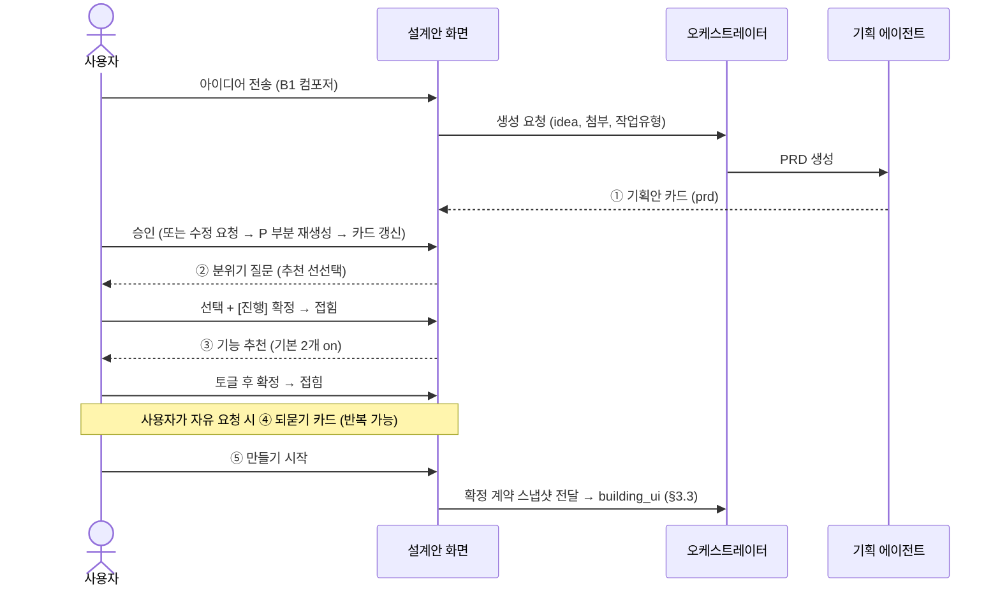

# AiApp 에이전트 기반 자율 생성 — 구현 명세

문서 목적: 개편 제안서(2026.07)에서 정의한 TO-BE 서비스를 개발팀이 구현에 착수할 수 있는 수준으로 설명한다. 본 문서는 상세 기획(PRD)의 초안이며, 확정 표기가 없는 수치·정책은 착수 후 협의로 확정한다.

대상 마일스톤: 모두의 창업 2기 (8월 말). 스코프는 본문 9장의 컷라인을 따른다.

---

## 1. 서비스 개요

사용자가 아이디어를 한 문장으로 입력하면, 에이전트 파이프라인이 기획 → 화면 생성 → DB 스키마 → 기능(API) → 배포·BaaS 프로비저닝을 자율 수행하여 운영 준비가 완료된 서비스를 배포한다. 사용자 접점은 입력 1회와 설계안 확인 1회로 제한한다(확인은 기본 동작 — 끄는 옵션 없음, 2026-07-21 확정). 모든 생성·빌드·실행은 사용자별 micro VM 안에서 이루어진다.

핵심 원칙 세 가지는 다음과 같다. 첫째, 입력은 한 문장이며 제목·도메인·템플릿·레이아웃 등은 에이전트가 아이디어에서 도출한다. 둘째, 에이전트 체인이 기획부터 기능까지 자율 실행하고 개입 지점은 설계안 확인 체크포인트 1곳만 둔다. 셋째, 배포 시점에 BaaS 리소스 프로비저닝이 완료되어 "운영 준비까지 자동"인 상태로 사용자에게 인계한다.

## 2. 사용자 플로우와 화면 명세

### 2.1 화면 B1 — 시작 화면

중앙에 질문형 헤드라인("어떤 서비스를 만들까요?")과 멀티라인 입력창 1개만 배치한다. 입력창 하단에 옵션 2개를 둔다: 첨부파일, 참고 링크(URL). 확인 모드는 토글이 아니라 기본 동작이다. 전송하면 크레딧 견적 없이 곧바로 설계안 대화(§2.5)로 진입한다 — 견적·예상 소요는 산정 불가로 표기하지 않는다(보류 목록 참조).

**프로젝트명 (2026-07-21 확정)**: 사용자가 짓지 않는다. B1에 이름 입력 필드가 없는 것은 의도이며, AI가 입력 내용을 파악해 **아이디어의 주요 주제를 서비스명으로 자동 결정**한다 (예: "동네 반려견 산책 예약을 받고 싶어요" → "멍멍 산책 예약"). 사용자는 설계안 ① 기획안 카드에서 확인하고 필요하면 수정한다.

입력 검증: 최소 길이(예: 10자) 미달 시 구체화를 유도하는 마이크로카피를 노출한다. **최대 4,000자** — 초과 입력은 차단(maxlength)하고 3,600자(90%)부터 카운터를 노출한다 (2026-07-21 확정). 첨부는 이미지·문서, 참고 링크는 URL 형식만 허용한다.

**유연 항목 — '내 프로젝트' 참조 첨부 (2026-07-21)**: 기존 프로젝트를 소스로 지정해 로고·숏폼 등 파생 작업에 참조시키는 기능. 기획·디자인에는 포함한다(B1 컴포저 '내 프로젝트' 칩 → 선택 피커 → 첨부 토큰). 단, **구현이 어려우면 초기 출시에서 미뤄도 된다** — 그 경우 칩만 숨기고(마크업 유지), 파생 작업은 해당 프로젝트의 스튜디오 채팅 또는 브랜딩·홍보 탭에서 진행한다. 화면 레퍼런스: `design/b1.html`.

### 2.2 화면 B2 — 에이전트 진행 화면

파이프라인의 5단계를 세로 리스트로 표시하고 각 단계의 상태(완료 / 진행 중 / 대기 / 실패)를 실시간 갱신한다. 진행 중 단계는 세부 진척(예: "예약 페이지 작성 중 · 3/6 화면")을 노출한다. 하단 고정 바에 예상 소모 크레딧과 "전용 micro VM에서 실행 중" 표시를 둔다. 실시간 갱신은 SSE(Server-Sent Events)를 기본으로 하고, 연결 유실 시 폴링으로 폴백한다.

기획 단계 완료 시 항상 파이프라인을 일시정지하고 기획 요약 카드(서비스명, 핵심 화면 목록, 기능 목록, 디자인 방향)를 표시한다. 사용자는 [이대로 진행] 또는 항목별 수정 후 [수정하고 진행]을 선택한다. 이 지점 외의 개입 UI는 두지 않는다.

**출시 게이트 (2026-07-21 확정)**: 생성 사이클이 끝나도 자동으로 공개하지 않는다. 완료 시 상태는 `ready`(미리보기) — 미리보기 배지는 "미리보기", 주소 표시는 "아직 주소가 없어요 — 출시하면 생겨요". 사용자가 미리보기를 확인하고 [출시하기]를 누르면 **배포 주소 설정이 첫 스텝**이다: 서비스명 기반 서브도메인이 미리 채워진 `____.aiapp.help` 입력 + 실시간 사용 가능 검사. 커스텀 도메인은 미지원(보류 목록 참조)이며, 미제공 기능은 화면에 노출하지 않는 원칙에 따라 관련 안내 문구도 두지 않는다. [이 주소로 출시하기] → `deployed` 전이, 배지 LIVE·주소 반영·채팅에 출시 보고, 완료 화면에서 주소 복사와 다음 행동(검색 노출·홍보 소재)을 안내한다. 화면 레퍼런스: `design/b2.html` (보고 카드 [출시하기] → 모달). **모달 구성 (2026-07-23 개편)**: 좁은 카드(440px) 한 흐름 — 질문 → 주소 입력(값은 왼쪽부터, `.aiapp.help` 접미사 오른쪽 고정) → 사용 가능 확인 → "출시하면 이렇게 돼요" 안심 3줄(누구나 접속 / 출시 후에도 수정 가능 / **검색에 바로 뜨지는 않음 — 반영 시차 고지**) → 풀폭 CTA. 완료 스텝도 같은 폭·풀폭 버튼 규칙(주소 복사 + 다음 행동 2줄).

#### 2.2.1 AI 응답 문법

에이전트의 채팅 출력은 자유 형식이 아니라 **상황별로 형태가 고정**된다 (질문 UI가 §2.4 패턴에 고정되는 것과 같은 원리). 화면 레퍼런스: `design/b2.html` 채팅 피드.

| 상황 | 형태 | 규칙 |
|---|---|---|
| 일반 안내·서술 | 플레인 텍스트 (`log-line`) | 말풍선·아바타 없음(Manus식), 1~2문장, 해요체 |
| 작업 완료 사실 | ✓ 체크 줄 (`log-chk`) | 사실 + 사용자 이득 한 줄 |
| 작업 진행 + 상세 스트림 | 접힌 상세 패널 (`aidetail`) | 헤더 한 줄 = "지금 하는 일" + 진행률 N/M + 경과 시간 · 펼치면 계획 체크리스트 + 원문 로그 — 독립 계획 카드 폐지 (2026-07-24 v3.1) |
| 차단 질문 | 일시정지 카드 (`pause-card`) | §2.4 — 답 대기. 답변 후엔 카드를 지우고 **한 줄 기록**(`log-gate`)으로 접어 잔존 — 카드 과밀 방지 (2026-07-24 v3.1) |
| 모호한 요청 | 되묻기 카드 (`ask`) | §2.4 — 비차단, 옵션 ≤4. **마지막 행은 항상 기타 자유 입력**(`card-input`, Enter 즉답) — 옵션에 담지 못한 의견을 놓치지 않는다 (2026-07-24 확정, 의견 확인 게이트 포함 전 되묻기 공통) |
| 출시 완료 | 보고 카드 (`report`) | 1회 — LIVE·URL·산출 목록·설정 필요 행(§3.2.2) |
| 완료 직후 | 다음 행동 추천 칩 (`next-sugg`) | 클릭 = 입력창 채움 (자동 전송 금지) |
| 단계 실패 | 오류 카드 (`pause-card` 위험 변형) | 자동 재시도(§3.3) 소진 후에만 노출 — 원인 한 줄(쉬운 말) + [다시 시도]/[여기서 멈추기]. 이전 산출물은 보존 안내 |

**진행 표현 개정 v3 (2026-07-24, 개발 문서 "AI 작업 실시간 스트림" 정합)**: 고정 단계 콘솔 카드를 폐기하고 **두 층 구조**로 교체한다. ① **기본 표면(일반 사용자)** — 짧은 답변 문장(타이핑 누적) · ✓ 완료 줄 · 완료 보고 카드만 시간순으로 흐른다. 파일 경로·영문·마크다운은 기본 표면에 노출하지 않는다. ② **상세 층(선택)** — "실시간 작업 내용" 접힌 패널: **헤더 한 줄이 진행 표시를 전담** — "지금 하는 일" 문구(커스텀 훅의 상태 문구 "파일을 읽는 중…" 등이 이 한 줄로만 반영) + 진행률 N/M + 경과 시간. 펼치면 작업 계획 체크리스트(상태 3종 pending/in_progress/completed) + 개발 구현의 원문 스트림(추론 원문·파일별 상태 `plan/plan.md · 완료`·긴 작업 요약 마크다운)을 **가공 없이 그대로** 담는다. 기본 접힘, 펼침 상태는 세션 동안 유지. **독립 작업 계획 카드는 폐지 (v3.1, 2026-07-24)** — 계획 카드가 채팅 흐름과 별개 위젯으로 시선을 분산시키고, 1~2분 생성 규모에선 카드가 일보다 커지는 문제. 계획 카드의 유일한 강점(전체 진행률)은 헤더 N/M로 대체. 짧은 수정 작업은 패널 없이 문장 + ✓ 줄로 끝(§2.2 Q3). ③ **훅에 없는 이벤트를 요구하지 않는다** — 그룹 구분선·단계 배지 등은 스펙 제외. 새 요소는 타임라인 아래로만 추가되고, 제자리 갱신은 계획 체크 상태 / "지금 하는 일" 문구 / (상세 층) 파일 상태 배지뿐. ④ 비노출(개발 문서 그대로): 도구 입력 JSON·diff·시크릿·서브에이전트 토큰 스트림. ⑤ ✓ 체크 줄·되묻기·일시정지·완료 보고 카드는 기존 유지 — 교체 대상은 진행 표현뿐. §2.2.3의 `console_update`는 `plan_update`(계획 스냅샷) + `now`(현재 수행 문구) + `detail_append`(상세 스트림)로 대체. 화면 레퍼런스: `design/b2.html?build=1`.

카피 규칙: 해요체 · 한 메시지 한 사실 · 수치/상태는 카드에 · 개발 용어 번역(테이블→예약/회원, SSE→실시간 연결, VM→전용 공간) · 가능하면 행동 유도로 끝맺기 · 되돌리기는 "이전으로"(버전 금지) · 이모지는 알림성 최소.

#### 2.2.2 응답 동작 상세 — 개발 Q&A (초안)

구현 시 반드시 나올 질문을 개발자 관점에서 선제 정리한 결정 초안. ⚠ 표시는 협의 후 확정 권장.

**Q1. 로그는 스트리밍인가, 한 번에 오나?**
줄 단위 완성형으로 온다 — 타자(typing) 효과 없음. SSE 이벤트 하나 = 채팅 요소 하나이며, 이벤트 `type`이 §2.2.1 문법과 1:1 매핑된다: `log | step | check | console_update | pause | ask | report | suggest | error`. 프런트는 type→컴포넌트 렌더만 하면 되고, 문구 생성 책임은 전부 서버(에이전트) 측이다.

**Q2. 단계가 실패하면 어떻게 말하나?**
단계 내 자동 재시도(§3.3)가 소진된 뒤에만 오류 카드를 낸다(재시도 중엔 진행 상태 카드가 계속 "진행 중"). 오류 카드 = 일시정지 카드의 위험 변형: 원인 한 줄(쉬운 말, 스택트레이스 금지) + [다시 시도]/[여기서 멈추기] + "지금까지 만든 것은 그대로 있어요" 안내. [다시 시도] = resume-from-stage.

**Q3. 운영 중 수정 요청의 처리 표시는?**
짧은 작업(문구·색 등)은 콘솔 카드 없이 로그 2줄로 끝낸다: 접수 즉시 "바꾸고 있어요…" 플레인 로그 → 완료 시 ✓ 체크 줄 + 미리보기 자동 갱신 + '이전으로' 활성화. 화면 추가 같은 큰 작업만 진행 상태 카드를 다시 쓴다. ⚠ 크고 작음의 기준(예상 30초 초과 여부 등)은 구현 협의.

**Q4. 되묻기(ask)는 언제 발동하나?**
두 조건에서만: ① 요청이 복수 해석 가능(결제 방식처럼 실행 결과가 크게 갈림) ② 실행에 필수 값이 빠짐(주소 등). 단순 취향 차이는 묻지 않고 AI 추천으로 진행 후 결과 보고에 명시한다. 되묻기는 요청당 1회 — 꼬리 질문 금지, 그래도 모호하면 기본값으로 진행.

**Q5·Q6. 질문이 떠 있거나 AI가 작업 중일 때 채팅은? (2026-07-21 확정)**
**타이핑은 항상 가능, 전송만 잠근다.** 전송 잠금 사유는 두 가지뿐이다:

- **활성 질의(ask·pause)가 있을 때** — 답을 먼저 받는다. 전송 버튼 비활성 + 빈 입력창 플레이스홀더 "위 질문에 먼저 답해 주세요 ↑". 자유 형식 답변은 질문 카드 안의 '기타' 입력이 담당. 답변(또는 pause 액션) 즉시 해제, 접힌 답을 '변경'으로 다시 열면 재잠금.
- **파이프라인·수정 작업 실행 중** — 전송 버튼 비활성 + "지금 작업 중이에요 — 끝나면 보낼 수 있어요". 사용자가 기다리는 동안 다음 요청을 미리 써둘 수 있고, 작업 완료 시 자동으로 전송이 열리며 써둔 내용은 유지된다. 큐잉은 하지 않는다(전송 자체가 잠기므로 동시 요청 충돌 없음).

**Q7. 다음 행동 추천 칩("이어서 이런 걸 해볼 수 있어요")의 기준 (2026-07-21 정리)**

- **노출 시점**: ① 최초 출시 완료 보고 직후 ② 운영 중 수정 작업 완료 직후 — 이 두 시점에만 1세트. 질의 활성·작업 실행 중엔 노출하지 않고, 매 메시지마다 반복하지 않는다.
- **개수**: 3~4개. 채울 만한 제안이 2개 미만이면 세트 자체를 생략한다(억지로 채우지 않음).
- **슬롯 우선순위**:
  1. **할 일** — 미완 설정(§3.2.2, 결제 연결 등). 단 같은 화면의 보고 카드에 '설정 필요' 행이 이미 보이면 칩으로 중복 노출하지 않는다.
  2. **방금 작업의 자연 후속** — 직전 작업과 같은 맥락의 다음 단계 (홈 문구 수정 → 다른 페이지 문구, 로고 생성 → 홍보 이미지).
  3. **성장 제안** — 브랜드·홍보 소재 등 서비스 카테고리 기반 제안.
  4. (자리가 남으면) **탐색** — 아직 안 써본 기능 소개 (엑셀 내보내기, 도메인 연결 등).
- **문구 형식**: 클릭 시 입력창에 그대로 들어가므로 **사용자 1인칭 요청문**으로 쓴다 ("홈 문구를 더 따뜻하게 바꿔줘" ○ / "문구 수정 기능" ✕). 클릭 즉시 실행 가능한 것만 제안한다 — 외부 절차가 필요한 항목은 요청문 대신 이동 링크형("결제 연결하러 가기 →").
- **중복·소멸**: 이미 실행한 제안, 2세트 연속 노출됐는데 클릭되지 않은 제안은 다음 세트에서 교체한다.
- **클릭 동작**: 입력창 채움까지만 — 자동 전송 금지.

**Q8. 재접속 시 채팅은 어디까지 복원하나?**
프로젝트 채팅 이력 전체를 저장·복원한다. 질문/보고 카드는 최종 상태(답변됨=접힘, 스킵=기본값 표기)로 렌더하고, 미답 차단 카드가 있으면 활성 상태 그대로 + 스크롤을 그 위치로. 그 외에는 맨 아래로 스크롤.

#### 2.2.3 채팅 이벤트 계약 (SSE, 초안 v0.1)

프로젝트당 SSE 스트림 1개. 모든 이벤트는 공통 envelope를 가진다 — `seq`는 단조 증가(순서 보장·중복 제거·재접속 `?after=seq` 커서), 필드명은 API 설계 시 확정하는 **제안**이다.

```json
{ "seq": 214, "type": "check", "ts": "2026-07-21T14:12:03Z", "payload": { } }
```

| type | payload 핵심 필드 | 클라이언트 렌더 (§2.2.1) |
|---|---|---|
| `log` | `text` | 플레인 텍스트 줄 추가 |
| `step` | `name` | 단계 구분선 |
| `check` | `text`, `preview_version?` | ✓ 줄 추가 · preview_version 있으면 미리보기 갱신 |
| `console_update` | `rows[{id,label,state,detail}]`, `footer?` | 기존 진행 카드 patch (최초 1회만 생성) |
| `pause` | `id`, `severity(warn\|danger)`, `text`, `actions[{id,label}]` | 일시정지/오류 카드 — 답 올 때까지 후속 이벤트 없음 |
| `ask` | `id`, `title`(질문), `desc`(설명문 — 왜 묻는지·무엇이 달라지는지), `options[{id,label,desc,recommended}]`, `allow_custom` | 되묻기 카드 (비차단 — 스트림 계속) |
| `report` | `name`, `url`, `items[]`, `todo[{label,section}]` | 완료 보고 카드 + 설정 필요 행 |
| `suggest` | `chips[{label,prompt}]` | 다음 행동 추천 칩 |

사용자 응답은 SSE가 아니라 REST: `POST /projects/{id}/answers { "question_id", "value" }` (자유 채팅은 기존 메시지 API). 카드 접힘은 클라이언트가 낙관적으로 처리하고, POST 실패 시 카드를 복원하고 토스트를 낸다.

클라이언트 필수 동작: ① `seq` 갭 감지 시 커서 재요청 ② 새 요소 도착 시 하단 자동 스크롤 — 단 사용자가 위로 스크롤 중이면 억제하고 "새 메시지 ↓" 배지 ③ 재접속 시 동일 `id`의 pause/ask는 dedupe ④ 전송 잠금 규칙(§2.2.2 Q5·Q6): 질의 활성 또는 작업 실행 중엔 전송 버튼만 비활성 — 타이핑은 항상 가능, 써둔 내용은 해제 시 유지.

#### 2.2.4 micro VM 부팅 대기 UX (2026-07-23 확정)

전용 micro VM은 켜지는 시간이 있다(콜드 스타트). 이 대기를 숨기지 않고 "이 서비스만 쓰는 전용 컴퓨터가 켜지는 중"이라는 사실로 설명한다 — 전용 공간 서사와 일관. 장치는 자리별로 3종:

| 자리 | 장치 | 구성 |
|---|---|---|
| B1 전송 → 설계 진입 | **부팅 스플래시** (`.vmboot`, components.css 공용) | 전원 아이콘 + 펄스 링 + 단계 3개(전용 컴퓨터 켜기 → 아이디어 전달 → 설계 시작) 순차 체크 후 이동 |
| 패널 안 부분 로딩 | **스켈레톤 + 상태 필** (`.vm-skel`, 스타일 준비됨 — 현재 미적용) | 화면 뼈대 즉시 표시 + 상단 다크 필 후 페이드. 관리·설정에는 부팅 연출을 두지 않기로 (2026-07-23) |
| 이미 생성된 프로젝트 다시 열기 (B2) | **콘솔 카드 + 미리보기 지연 등장** (기존 `console-card` 재사용) | "다시 열기" 단계 구분 + 진행 카드 3행 + ✓ 체크 줄 — §2.2.1 문법과 동일. **카드는 부팅 중에만 노출 — 켜지면 카드를 접고 ✓ 한 줄("준비됐어요")만 남긴다** (2026-07-24 v3.1, 카드 과밀 방지). **부팅이 끝나야 미리보기가 나타난다**(그동안 스켈레톤 "여는 중이에요"). 상태 시연 스위처에 "부팅 중" 상태 포함. 빌드 연출과는 공존하지 않음 |

공통 규칙: ① 1초 미만이면 아무것도 노출하지 않는다(깜빡임 금지) ② **문구에 소요 시간·"다음엔 바로 열려요" 같은 약속을 쓰지 않는다** — 사실만("켜고 있어요", "준비되는 대로 이어서 진행돼요") ③ 장시간 지연 시 무한 스피너 금지 — "계속 기다리기 / 새로고침" 분기(임계값은 구현 협의). 화면 레퍼런스: `design/b1.html`(전송 시), `design/b2.html`(재접속·상태 시연 "부팅 중").

### 2.3 화면 B3 — 완료 대시보드

상단에 LIVE 배지와 서비스 URL, 그 아래 BaaS 상태 체크리스트(회원 인증, DB 스키마, 발송 대상 연동, 게시판)를 표시한다. 완료 후 진입점은 두 가지다: 기존 채팅·에디터로 사후 수정, 운영관리(BaaS) 콘솔로 이동. 기존 편집 도구는 TO-BE에서도 그대로 유효하다.

### 2.4 에이전트 질의·선택지 UX 패턴

에이전트가 사용자에게 질문하거나 선택지를 줄 때는 매번 화면을 창작하지 않고 아래 고정 패턴 중 하나를 쓴다(DB 뷰 템플릿과 같은 원리 — 골라서 채우기).

**5원칙**

1. **한 번에 하나** — 질문은 한 화면(카드)에 하나. 여러 답이 필요하면 대화형 스텝으로 쪼갠다(로고 위저드 방식).
2. **기본값 선제 선택** — 모든 선택지는 AI 추천이 선택된 상태로 제시한다. 사용자는 그대로 진행만 해도 되고, 무응답 시 기본값으로 진행한다(스킵 = 실패가 아님).
   **'AI 추천' 배지의 기준** — 추천은 질문당 정확히 1개, 근거 우선순위: ① 프로젝트 맥락 정합(기획서 내용·이미 답한 선택·기존 브랜드와 일관 — 예: 로고 색 추천 = 지금 브랜드색) ② 동종 서비스의 모범 사례(같은 카테고리에서 가장 흔한 선택 — 예: 예약 서비스의 결제 = 예약금만, 노쇼 방지) ③ 동률이면 더 가역적인 쪽(부작용·비용이 적고 되돌리기 쉬운 옵션 — 예: 사진 3장 vs 무제한). 추천 근거는 옵션 설명 한 줄로 반드시 노출한다("노쇼를 줄여줘요"). 세 근거 모두 없으면 배지를 달지 않거나 'AI에게 맡기기'를 추천으로 둔다. 사용자의 과거 선택과 충돌하는 추천은 금지 — 과거 선택이 이긴다.
3. **선택지는 최대 4개 + 직접 입력** — 5개 이상이면 질문을 쪼개거나 "직접 입력"으로 흡수한다. 자유 형식 답은 질문 카드의 '기타' 입력이 담당한다.
4. **질의 활성 중 채팅 잠금** — 질의 카드(ask·pause)가 떠 있는 동안 채팅 입력은 잠긴다(§2.2.2 Q5) — 답을 먼저 받는다. 단 파이프라인 차단 여부는 별개: 취향 질문(ask)은 파이프라인이 계속 돌고, 차단 질문(pause)은 설계안 확인 게이트(§2.2)와 실행 중 예외(§3.4) 두 곳으로 한정한다.
5. **답은 로그로 남는다** — 선택 완료 시 선택지 UI는 접히고 요약 한 줄("분위기: 따뜻한 ✓")이 사용자 발화로 채팅에 남는다. 요약을 누르면 재선택할 수 있다. (레퍼런스: blueprint.html `log-answer` — 분위기·기능 카드의 접힘/변경)

**질문 유형 → UI 패턴 매핑**

| 유형 | 예 | 패턴 | 레퍼런스 |
|---|---|---|---|
| 단일 선택 (시각) | 디자인 분위기, 템플릿 | 비주얼 카드 그리드 (썸네일+이름) | blueprint.html `tpick` |
| 단일 선택 (텍스트) | 색상, 스타일 | 단일 선택 칩 | brand.html `cchip[data-single]` |
| 복수 선택 | 추천 기능 켜기 | 토글 칩 (＋↔✓ 스왑) | blueprint.html `fchip` |
| 짧은 자유 입력 | 이름, 주소 | 인라인 한 줄 입력 (비워도 진행) | blueprint.html `card-input` |
| 확인 게이트 | 설계안 승인 | 요약 카드 + [이대로 만들기]/[수정 요청] 버튼 쌍 | blueprint.html `pcard__actions` |
| 경로 분기 | 바로 만들기 vs 더 다듬기 | 경로 카드 2개 (제목+결과 설명) | brand.html `wpath` |
| 구체화 질문 (모호한 요청 되묻기) | "결제도 받고 싶어요" → 어떻게? | **제목(질문) + 설명문(왜 묻는지·무엇이 달라지는지)** + 옵션 카드(AI 추천 표시, 원탭 즉답) + 기타 직접 입력 — 설계 단계와 운영 중 대화 공통 | blueprint.html·b2.html `ask` |
| 실행 중 차단 질문 | 한도 초과, 충돌 | 채팅 인라인 경고 카드 + 버튼, 파이프라인 일시정지 + "답을 기다리고 있어요" 상태 | b2.html `pause-card` (답변된 히스토리 상태) |

**상태 정의**: 질문 카드는 `대기(활성) → 답변됨(요약으로 접힘) / 스킵(기본값 적용 표기)` 세 상태를 가진다.

### 2.5 설계안 단계 상세 (B1 → B2 사이) — 개발 참조

동작하는 레퍼런스: `design/blueprint.html` (순차 진행·접힘·되묻기가 실제로 클릭됨). 원칙: **화면에 보이는 모든 정보는 산출물 계약(§3.2)의 필드에서 온다** — 화면 전용 데이터를 만들지 않는다.

#### 흐름



#### 단계별 명세

| # | 단계 | AI가 보여주는 정보 | 데이터 출처 (계약 필드) | 사용자 행동 | 질문 유형 (§2.4) | 무응답·스킵 시 |
|---|---|---|---|---|---|---|
| ① | 기획안 카드 | 서비스명 · 한 줄 소개 · "이런 걸 해결해요" · 핵심 기능(아이콘+설명) · 화면 구성 N개 · 데이터 저장소(테이블+주요 필드) · 타겟 | `prd.service_name` `prd.description` `prd.problem` `prd.features[]` `prd.screens[]` `prd.data_entities[]` `prd.target_user` | [좋아요, 다음으로] 승인 / [수정 요청] → 채팅으로 고쳐 말함 | 확인 게이트 | **차단** — 답 대기 (`awaiting_confirm`) |
| ② | 분위기 선택 | 스타일 4종 카드(썸네일+이름+한 단어 설명), 추천안 선선택 + 직접 입력 | `design_tokens` 후보 세트 (기획 에이전트가 prd 기반 4종 생성) | 선택 후 [이 분위기로 진행] 확정 → 접힘 (선택만으로 넘어가지 않음) | 단일 선택(시각) | 추천안 적용 |
| ③ | 기능 추천 | 유사 서비스 빈출 기능 칩 (기본 2개 on, 외부 절차 기능엔 '출시 후 연결' 라벨 §3.2.2) + 직접 추가 | `prd.features[]` + 기능 카탈로그(auth·board·recipient·db·custom) | 칩 토글 → [확정] → 접힘 | 복수 선택 | 기본 on 그대로 |
| ④ | 구체화 되묻기 | 모호한 자유 요청을 옵션 2~4개로 좁힘 (AI 추천 표시) + 기타 입력 | 요청 파싱 결과 → 해당 계약 필드에 기록 | 원탭 즉답 / 기타 Enter → 접힘 | 구체화 질문 | AI 추천 적용 |
| ⑤ | 만들기 시작 | 확정 요약("다 정해졌어요") + 시작 버튼 | ①~④ 반영된 계약 스냅샷 | [만들기 시작] → B2 진입 | — | — |

#### 구현 규칙

- **수정 루프**: ①에서 [수정 요청]은 채팅 입력으로 이어지고, 기획 에이전트가 해당 부분만 재생성해 카드를 갱신한다. 이미 답한 ②③은 유지된다.
- **접힘 = 기록**: 모든 답은 "라벨: 값 ✓" 요약으로 채팅에 남고(사용자 발화 취급), 클릭하면 재선택할 수 있다. 재선택해도 이후 단계 답은 보존한다.
- **④는 어디서든**: 되묻기는 설계안 전용이 아니라 채팅 공통 패턴이다(§2.4). 설계안 중이든 운영 중이든 같은 컴포넌트를 쓴다.
- **상태 연결**: ①의 승인이 §3.3의 `awaiting_confirm → building_ui` 전이 트리거다. ②~④는 비차단 — 무응답이면 기본값으로 진행한다.

#### 기획 에이전트 출력 계약과 설계안 v2 (2026-07-22 초안)

기획 에이전트의 프롬프트 원문과 출력 JSON 스키마는 `agents/planning-agent-prompt.md`에 보관한다. 핵심 결정: 출력 JSON 하나가 ① 사용자 확인 화면과 ② 구현 에이전트 입력을 동시에 담당한다 — 화면 전용 데이터를 만들지 않는다는 §2.5 원칙의 강화판. 판단 순서(인증 → BaaS 재사용 매핑 → 데이터 모델 → 화면 흐름 → 레이아웃 → confirmed/assumed 구분 → 난이도 라우팅)와 self_serve/enterprise 라우팅, confidence(추측 항목 정직 표시) 규칙을 포함한다. 이 JSON을 그리는 화면 시안: `design/blueprint-v2.html` — **스튜디오형 2단: 좌 채팅 질의 · 우 기획안 아티팩트 (2026-07-22 방향 확정)**. 레이아웃은 B2 스튜디오와 동일(공용 사이드바 + 좌 채팅 · 리사이저 · 우 패널, 우측 배경 rgb(249 250 251)). 예시는 B2B — 식자재 도매 발주(청솔 식자재: 품목 골라 담기 / 접수 알림톡 / 상태 대기·확정·출고·완료). 질의는 채팅 문법(되묻기 카드·접힘 재선택·타이핑 가능/전송만 잠금 컴포저)으로 진행한다. **문서는 고정 규격 + JSON 일괄 바인딩 (2026-07-22 확정)**: 질의 중 우측은 빈 규격(스켈레톤 — 섹션 제목은 실제, 값 자리는 회색 바)이고, 티키타카가 끝나면 에이전트 JSON 1회 도착으로 문서 전체가 한 번에 채워진다. 중간중간 채우는 연출 없음 — 프런트는 고정 템플릿에 값만 바인딩. 확정 버튼은 완료 전 비활성, 완성 후 접힘 재선택 시 해당 슬롯만 갱신. **기획안 문서에 이모지 금지** — 태그·견본·타이포만으로 구분. 질의 완료 시 컴포저가 풀려 자유 수정 요청을 받는다. **기획서 양식 (2026-07-23 확정)**: 밑줄 섹션 제목 + 좌 라벨·우 내용 행이 위→아래로 이어지는 문서형. 구성 순서 = 개요(목표·배경) → 이렇게 이해했어요(요청/대화로 확정/추측 3단 태그, 대화 확정 슬롯 포함) → 문제 및 해결방안 → 타겟 및 시나리오 → 디자인 브리프(선택 요약 + design_tokens 시각화: 컬러 팔레트·글꼴 샘플·미니 견본 — 시스템 상세는 비노출) → 화면 흐름(와이어프레임) → 저장하는 정보(항목 카드) → 성공·위험 요소(인라인, 접이식 폐지, 리스크엔 대응책 필수) → 속성(카테고리·역할·기기). 필요한 JSON 확장 필드(meta.goal/background/category/roles/devices, narrative, targets[], scenario, metrics[], risks[])는 `agents/planning-agent-prompt.md` 확장 제안 참조. 흐름: B1 요청 → ⓪ **진행 방식 분기 (2026-07-23 확정)** — "기획서를 함께 다듬을래요(추천)" vs "AI에게 다 맡길래요"(전 질문에 추천값 자동 적용 후 바로 기획안 — 확인 게이트는 동일) → ① **기능 질의 2개**(예약 방식·확정 안내 — 화면·데이터가 갈리는 분기만) → ② **디자인 질의 2개**(분위기·글씨 느낌 — 옵션에 톤 견본, 답 = design_tokens 세트 선택) → ③ **기획안 정리** — 흰 배경 단일 문서: 이해 요약(요청하신 내용/대화로 확정/추측함 3단 출처 태그), 화면 흐름(와이어프레임 썸네일, is_core 파란 테두리), 저장하는 정보(예시값 필수), 디자인 방향(고른 대로 반영), 확정 게이트 — 완성 시 채팅에서 **경로 선택**: "이대로 만들기 시작"(→ 생성 진행) vs "와이어프레임으로 먼저 볼래요"(→ 와이어프레임 확인 화면). **와이어프레임 확인 (2026-07-23 신설, `design/wireframe.html`)**: 기획안의 화면 흐름(screens[])·저장 정보(data_model[])를 **컴포넌트로 조립한 로우파이 화면**을 화면 탭(screens[] 순서)으로 넘겨보는 구조 확인 단계. 색·브랜딩 미적용 — 뉴트럴 그레이(shadcn 계열 컴포넌트 톤)에 CTA만 검정으로 위계 하나만 남긴다. 텍스트는 기획안의 실제 카피(로렘 입숨 금지), 이미지 자리만 점선 박스, 데이터 저장 지점은 라벨("발주 데이터로 저장돼요")로 표시. 수정은 채팅으로 받고 구조 반영 후 갱신, [좋아요 이대로 만들기 시작] 시 디자인 브리프의 토큰을 입혀 생성 진행. 구현 옵션(자체 로우파이 컴포넌트 셋 vs shadcn/ui 뉴트럴 테마 렌더)은 협의. 이 화면의 범위는 기획안 확인까지 — 생성 진행은 별도. **v3 개편 (2026-07-24 확정)**: ① 우측 레일 = 문서 서브탭 [기획서 | 디자인 | 와이어프레임] — 디자인 질의 결과(선택 요약 + 팔레트·글꼴·미니 견본)는 기획서 본문에서 빠져 전용 디자인 탭으로, 완성 시 점 배지. **패널 레일 B안 (2026-07-24 확정)**: 기획 산출물 3종(기획서·디자인·와이어프레임)은 기획서 표면 안의 서브탭으로만 오가고, 전역 레일(기획서·미리보기·데이터베이스·브랜딩·홍보·관리·설정)은 **5탭 상한**을 지킨다. 라벨은 상시 노출(놓침의 원인은 접힘이 아니라 라벨 부재), 좁은 폭(≤1366px)에서만 비활성 탭이 아이콘으로 접힘. 확인 필요 항목은 라벨이 아니라 **숫자 배지**(`ptab__cnt`)가 부른다. 메뉴 증가 규칙: 문서가 늘면 기획서 서브탭으로, 운영 기능이 늘면 관리·설정 사이드바로 — 레일에는 더하지 않는다. ② 기획안은 단일 스크롤 문서 유지 + **왼쪽 플로팅 목차**(반투명, 스크롤 스파이, 클릭 점프) ③ 개요 = **한 줄 정의 · 목적 · 사용자(주문/운영 구분) · 플랫폼(알약)** 4행 — JSON 확장 meta.one_liner/goal/users[]/platform ④ **의견 확인 게이트 신설** — 기능 질의 종료 후 개방형 질문("빠졌거나 다르게 하고 싶은 게 있나요?") 1회, [이대로 좋아요] 또는 자유 입력 반영 후 기획안 바인딩 → 디자인 질의(맡기기 모드는 생략) ⑤ **확정 게이트 (2026-07-24 개정)** — 디자인 질의는 사용자가 기획서를 확인하고 확정한 뒤에만 시작한다: 기획안 바인딩 후 채팅 버튼 또는 문서 하단 [이 내용으로 확정하고 디자인 정하기] 어느 쪽으로든 확정 (v1·v2 공통). 같은 날 오전의 "하단 확정 버튼 제거" 결정은 이 게이트로 대체됨. 최종 진행(만들기 시작/와이어프레임)은 여전히 채팅의 경로 선택이 단독 담당 ⑥ 수정 요청 = **행(항목) 단위 호버** — 줄 하이라이트 + "이 부분 수정하시겠어요?" 버튼 → 컴포저에 "섹션 · 항목" 칩(💬 섹션 아이콘 폐기, 터치는 행 탭으로 대응). **v2 흐름 — 수집 우선 (2026-07-24, `design/blueprint-v3.html`)**: ① 첫 단계에서 반드시 수집 — 만드는 이유(해결할 문제)·목적·원하는 결과 3문을 열린 질문 + 자유 입력으로 사용자에게 직접 듣는다(AI가 배경을 지어내지 않음, 원문이 기획서 "배경과 목표"에 인용 그대로 실림) ② 문서는 결과물 중심 재구성 — 개요 / 배경과 목표(수집 원문) / 화면 구성 / 사용자 흐름 / 기능 목록(추론 + 발화 근거 인용) / 저장하는 정보 / 속성 ③ **디자인 질의는 기획서 확정 액션 뒤에만** — 기획안 바인딩 후 채팅 버튼 또는 문서 하단 [이 내용으로 확정하고 디자인 정하기] 어느 쪽으로든 확정해야 디자인 질의가 시작된다(v1의 "하단 확정 버튼 제거"는 v2에서 이 게이트로 대체) ④ **화면 구성 = 썸네일 없는 슬롯 카드 (B안, 2026-07-24 확정)** — 화면 1개 = 카드 1장: 번호(핵심은 파란 테두리) + 이름 + 역할 한 줄 + "들어가는 내용" 칩. 전부 screens[] JSON 슬롯으로만 렌더 — 확장 필드 `role`(역할 한 줄)·`elements[{label, core}]`(구성 칩)·`next`(다음 화면). 프런트가 화면을 그리지 않는다는 원칙(고정 규격 + 내용 교체)에 따라 유형 썸네일(layout enum 5종) 안은 보류 — 시간이 생기면 카드 좌측에 추가하는 확장으로 검토. 화면 7개 이상이면 핵심(is_core)만 카드, 나머지는 표 폴백 ⑤ 목적 질문은 직전 답에 앵커("그 불편이 해결되면, 뭐가 달라지면 좋을까요?") + 예시 힌트로 백지 부담을 낮춘다. v1(blueprint-v2.html)과 우하단 [v1|v2] 스위치로 오간다. 공통 질의 규칙: 옵션 2~3 + AI 추천, "잘 모르겠어요" = 추천 적용, 접힌 기록 클릭 = 재선택, 상단 스테퍼(1 기능 → 2 디자인 → 3 기획안) 상시 노출. 매핑·규칙 상세는 화면 개발 노트. 미정: 기존 ①~⑤ 순차 대화와의 관계, 질의 생성 주체(에이전트 동적 vs 업종 고정 세트).

## 3. 에이전트 파이프라인

### 3.1 구성

오케스트레이터 1개와 실행 에이전트 5개로 구성한다. 오케스트레이터는 단계 순서 제어, 산출물 검증, 상태 전이, 크레딧 계측, 실패 처리를 담당하고 실행 에이전트는 각자의 산출물만 책임진다.

| 순서 | 에이전트 | 입력 | 산출물 |
|---|---|---|---|
| 1 | 기획 | 사용자 문장, 첨부, 참고 링크 | PRD 문서(JSON), 디자인 시스템 토큰, 화면 목록, 기능 요구 목록 |
| — | (체크포인트) | 기획 산출물 요약 | 사용자 승인 또는 수정 반영본 |
| 2 | 화면 생성 | PRD, 디자인 토큰, 화면 목록 | 페이지별 프론트 코드, 라우팅 구성 |
| 3 | DB 설계 | PRD의 데이터 요구 | 테이블 스키마(DDL), 시드 데이터 정의 |
| 4 | 기능(API) | PRD 기능 목록, DB 스키마 | 기능별 API 코드, 프론트 연동 코드 |
| 5 | 배포·BaaS | 전체 산출물 | 배포 완료 URL, BaaS 리소스 프로비저닝 결과 |

### 3.2 산출물 계약(Artifact Contract)

에이전트 간 인터페이스는 자연어가 아니라 스키마가 고정된 JSON 산출물로 한다. 오케스트레이터는 각 단계 완료 시 산출물을 스키마 검증하고, 실패 시 해당 에이전트에 1회 재생성을 지시한 뒤 재실패하면 파이프라인을 실패 상태로 전이한다. 최소 계약 예시:

```json
{
  "prd": {
    "service_name": "string",
    "description": "string  — 한 줄 소개 (설계안 카드·로고 브리프에서 재사용)",
    "problem": "string  — 이런 걸 해결해요 (설계안 카드)",
    "target_user": "string",
    "screens": [{ "id": "string", "name": "string", "purpose": "string" }],
    "features": [{ "id": "string", "type": "auth|board|recipient|db|custom", "description": "string" }],
    "data_entities": [{ "name": "string", "fields": [{ "name": "string", "type": "string" }] }]
  },
  "design_tokens": { "palette": {}, "typography": {}, "layout": {} }
}
```

`features[].type`은 BaaS 프로비저닝 매핑(5장)의 키가 되므로 열거형으로 고정한다. `custom`은 BaaS 표준 기능 밖의 요구를 뜻하며, 기능 에이전트가 개별 API로 생성한다.

#### 3.2.1 DB 뷰 템플릿 계약

데이터베이스 탭 화면은 에이전트가 매번 생성하지 않는다. 플랫폼이 **고정 템플릿 4유형**을 제공하고, 에이전트는 스키마 생성 시 테이블마다 "템플릿 선택 + 슬롯 매핑" 메타데이터만 출력한다(자유 생성 금지 — 골라서 채우기만 허용). 유형과 선택 기준:

| 템플릿 | 용도 | 필수 슬롯 | 선택 기준 |
|---|---|---|---|
| `inbox` 인박스형 | 처리할 일이 쌓이는 데이터 (예약·문의·주문·신청) | who(사람/회사명) · when(일시) · status(enum) | 상태 enum + 일시 + 주체 필드가 모두 있을 때 |
| `feed` 게시글형 | 내용이 주인공인 데이터 (후기·게시글·공지) | author · body(긴 텍스트) · created · 선택: rating(별점) · parent(연결 엔티티 참조) · replied(답변 여부) | 긴 텍스트 본문 필드가 중심일 때 |
| `directory` 명부형 | 엔티티 목록 (회원·제공자·제품·설비) | name · attrs(속성 2~3) | 사람/사물 마스터 데이터일 때 |
| `grid` 표형 | 폴백 — 컬럼을 그대로 그리는 데이터 그리드 | 없음 (스키마 그대로) | **위 매핑이 하나라도 애매하면 무조건** |

요약(운영 현황) 대시보드는 자동 생성이며 **관리·설정 탭의 첫 화면**에 둔다 (2026-07-23 이동 — DB 탭은 저장소 열람 전용이므로): 방문자·회원(거래처)·주 데이터 건수 스탯 + 처리 대기 바로가기 + 최근 7일 추이 차트(방문자·주 데이터). **관리·설정 메뉴 구성 (2026-07-23 축소)**: 시안은 운영 현황 · 공개·주소 · 검색 노출 3개만 유지한다. 기능 설정(회원 가입·로그인, 게시판·후기, 예약 알림, 결제)과 데이터·이력(연락처 저장, 이전으로 되돌리기) 그룹은 잠정 제거 — 기능을 차근차근 확정하며 "기능 관리" 그룹으로 하나씩 다시 붙인다.

**기능 관리 배치 규칙 (2026-07-24 확정)**: 기능 관리는 그 앱에 붙은 기능만 나타나는 동적 그룹이며, 정렬은 붙인 순서가 아니라 **고정 카테고리 순서**를 따른다 — ① 매일 처리가 생기는 운영 기능(예약, 스토어) ② 사람·소통(회원 관리, 메시지) ③ 콘텐츠(게시판) ④ 돈·인프라(결제). 어떤 조합이든 "오늘 할 일이 위, 가끔 만지는 게 아래"가 유지된다. 패턴 판정: **예약 = 단일 항목**(신규 예약 분리 + 목록 + [예약 만들기]는 화면이 아니라 행동 → 버튼·드로어), **스토어 = 아코디언**(상품 관리 / 주문 관리 / 스토어 설정 — 성격이 다른 진짜 하위 화면). 예약과 스토어 주문은 같은 처리 문법(신규 분리 + 목록 + 상태 전환)을 공유하되 메뉴는 분리 — 청솔 예시의 "발주"는 스토어 주문의 B2B 변형. 운영 현황(요약)·DB 탭(열람)·기능 관리(처리)의 3분리 원칙 유지, 운영 현황 배너는 해당 처리 화면으로 딥링크. 현재 예약·스토어는 자리 페이지만 구축(상세 설계는 추후) — `design/settings.html?view=resv|store-items|store-orders|store-set`.

**기능 관리 — 결제(지급대행) (2026-07-24 확정 시안 구축)**: 토스페이먼츠 지급대행 셀러 등록 요건 기반, 같은 자리 뷰 교체(등록 폼 ↔ 상태 관리). ① **등록 폼** — 사업자 유형(개인사업자/법인/개인)이 첫 분기: 개인은 사업자번호·상호·개업일 미노출, 라벨 대표자명→이름. 필드 = 대표자명 · 사업자등록번호(10자리) · 상호(선택) · 개업일(사업자등록 진위확인용 — 토스 필수 아님) · 이메일(심사 안내 발송) · 연락처(본인인증용) · **정산 계좌 3종**(은행·계좌번호·예금주) + [예금주 확인] 사전 검증. "왜 필요한가요" 카드로 지급대행 개념·암호화 전달 설명. refSellerId는 시스템 발급(사용자 입력 아님), 등록 요청은 JWE 암호화 구간. ② **상태 관리** — 5단계 스테퍼: 정보 등록 → **접수 확인(플랫폼 자체 검토 — 자동으로 넘어가지 않음, 시간 약속 문구 금지, 완료 시 알림·이메일)** → 본인인증(개인·개인사업자 필수, 법인은 자동 완료) → KYC 심사(주 1천만 원 이상 지급 시, 이메일 안내, 1/3년 재심사) → 승인. 단계별 지급 한도 3칸(지급 불가 → 주 1천만 원 미만 → 한도 없음)으로 단계의 이유를 설명. 사이드바 배지 = 상태 동기화(등록 필요 → 확인 중 → 본인인증 → 제거). 개인 셀러 원천징수(3.3%) 세무 처리는 보류 항목. 화면 레퍼런스: `design/settings.html?view=pay`.

**기능 관리 — 회원 관리 (2026-07-23 신설, 첫 사례)**: AI가 기획·생성 중에 붙인 기능마다 대응하는 관리 화면이 관리·설정의 "기능 관리" 그룹에 생긴다 — 회원 기능이 있으면 회원 관리가 생기는 식. 회원 관리 구성 (2026-07-23 개편 — 신청함 분리 + 정돈 테이블): ① **가입 방식 설정** — "바로 가입" vs "승인 후 가입" 세그먼트 ② **가입 신청함** — 승인 대기는 목록 표가 아니라 별도 카드 그룹(할 일은 위로): [승인] 시 목록 맨 위에 새 행으로 들어오고 회원 수·필터 칩·사이드바 대기 배지 연동, 비면 빈 상태 안내. **다건 규칙 (2026-07-23 확정 — 점진 공개)**: 1~3건은 카드, 4건부터 리스트로 전환하되 **최신 3건만 보이고 나머지는 "신청 N건 더 보기"로 접힘** — 라벨에 건수("가입 신청 7건"), 행당 [승인]/[거절] 개별 처리(일괄 승인·처리 큐는 검토 후 제외 — 승인제 취지 보호 + 화면 단순), 펼쳐도 스크롤 캡으로 회원 목록을 밀지 않음, 하단에 "신청이 자주 쌓이면 바로 가입으로 바꾸는 것도 방법" 힌트로 가입 방식 설정과 연결. 회원 아이디 표기는 모노 글꼴을 쓰지 않는다(회색 보조 텍스트로만 구분). ③ **회원 목록** — 검색(아이디·이름·연락처) + 권한 필터 칩(전체/일반/관리자) + 사람 묶음 컬럼(아바타 이니셜 + 이름·권한 칩 + 아이디) · 연락처 · 최근 접속 · 가입일. 행 동작(메시지·탈퇴)은 호버 시에만 노출 ④ **메시지** — 체크박스 선택(행 [메시지]는 그 회원만 선택) → 알림톡 / SMS·MMS 채널 선택 후 발송(알림톡 실패 시 SMS 자동 대체) ⑤ **탈퇴** — 한 번 더 눌러 확정(이중 확인), 관리자 본인은 탈퇴 불가. 화면 레퍼런스: `design/settings.html?view=members`.

**기능 관리 — 메시지(UMS) (2026-07-23 신설)**: 하위 화면이 여러 개인 기능은 사이드바 **아코디언**으로 붙인다 — 접으면 "메시지 ▸" 한 줄 + 하위 알림 합산 배지, 펼치면 하위 5개가 들여쓰기로(배지는 해당 하위 항목으로 내려감), 하위 화면에 있는 동안 자동 펼침·벗어나면 접힘. 하위 구성(기존 UMS 안 수용): ① **대시보드** — 오늘/이번 주/이번 달 발송량 + 성공률 스탯, 일별 발송량(7일), 발송 유형별(알림톡/SMS/MMS 비중 — SMS엔 대체 발송 포함 주석) ② **발송대상** — 그룹 관리(좌) + 명단(이름·전화번호·설명·그룹, 우) + 엑셀/직접 등록·선택 삭제. 회원 관리의 회원과 별개인 수신 동의 명단 ③ **메시지 발송** — 채널 세그먼트(알림톡 / SMS·MMS)에 따라 폼이 갈린다. 공통 "발송 설정" = 발송대상·발신 번호. **알림톡은 승인 처리된 템플릿만 발송 가능 (2026-07-23 확정)**: "템플릿" 섹션 = 템플릿 선택(승인 목록만) + 선택한 템플릿의 속성 표시 — 카테고리·서브 카테고리·알림톡 유형·강조 유형(읽기 전용, 템플릿에서 옴). 내용도 템플릿 고정(읽기 전용, 변수 #{...}만 발송 시 자동 치환) — 바꾸려면 템플릿에서 수정 후 재검수. SMS·MMS는 자유 작성: 템플릿 불러오기(선택)·제목(MMS)·내용·이미지 첨부. 공통: 수신자 폰 미리보기·지금/예약 발송·테스트 발송 ④ **템플릿** — 알림톡 탭(상태[승인/검수 중/반려]·템플릿명·카테고리·유형·생성일시, 검수 1~3일·광고성은 SMS 안내) / SMS·MMS 탭(메시지 타입·템플릿명·카테고리·생성일시) ⑤ **발송이력** — 타입·내용·성공·실패·대기·발송일시 + 필터(전체/알림톡/SMS·MMS/실패만), 예약 건은 대기. **발송 기능은 이 메뉴 한 곳에만** — 회원 관리의 [메시지 보내기]는 선택 인원이 발송대상에 채워진 채 발송 화면으로 이동. 딥링크 `?view=msg-dash|msg-aud|msg-send|msg-tpl|msg-hist`. **날짜·일시 표기는 `연도-월-일 시:분`(예: 2026-07-23 09:12)으로 통일** — 발송일시·생성일시·가입일 등 관리 화면 전반의 규칙 (2026-07-23). 화면 레퍼런스: `design/settings.html?view=msg-dash`.

**기능 관리 — 게시판 (2026-07-23 신설)**: 핵심 전환 — 게시판은 "유형을 골라 만드는 페이지 템플릿"이 아니라 **에이전트가 대화로 만들어 주는 기능이고, 관리 화면은 그 결과로 자동 생성**된다. ① **생성·구조 변경은 채팅** — "거래처 후기 게시판 만들어줘" 한 문장으로 DB 테이블(posts, comments)·페이지·관리 화면이 함께 생기고, 기존 유형(커뮤니티·리뷰·링크형)은 사용자 선택지가 아니라 에이전트의 시작 스키마 프리셋으로 강등(후기→별점 필드 등, 이후 "재구매 여부도 받아줘"처럼 자유 확장). 게시판 이름도 에이전트가 서비스 맥락으로 작명(수정 가능). ② **운영은 화면** — 기존 설정 항목 전부 계승: 게시판 보이기(활성화)·댓글 허용·파일 첨부 허용·상세조회 로그인 필수·분류(그룹·카테고리)·게시판 삭제(위험 구역, 삭제 전 엑셀 백업 안내). 기본 게시판(공지사항·FAQ)은 프리셋 유지 + 축소 설정(보이기·로그인·분류)만, 삭제 불가. ③ **글 목록** = 제목·분류·상태(게시/숨김)·조회수·등록일 + 검색·상태 필터 + [새 글 쓰기](관리자 작성형만 — 방문자 작성형(후기)은 버튼 없음). 새 글은 탭 점 + 사이드바 배지. **행 클릭 = 글 상세 드로어 (2026-07-23)** — 목록을 남겨둔 채 우측에서 열리고(스크림 + Esc/바깥 클릭 닫기), 본문·분류·상태·등록일·조회수 표시 + [숨기기/게시하기] 즉시 전환·[글 수정]. "목록 보며 대조가 필요한 화면에 드로어" 원칙의 첫 적용. ④ **화면 배치** — 게시판 수가 가변이라 사이드바 아코디언 대신 **항목 1개 + 화면 안 게시판 탭**, [+ 새 게시판]은 폼이 아니라 채팅 컴포저로 연결(요청문 채움, 자동 전송 금지). 설정은 **같은 자리 뷰 교체**(목록 ↔ 설정, "← 목록으로") — 드로어·아래 펼침 검토 후 확정 (2026-07-23). 데이터는 일반 DB 테이블로 데이터베이스 탭에서 열람(열람 전용 원칙 유지). 미정: 게시판 삭제 시 데이터 보관 정책. 화면 레퍼런스: `design/settings.html?view=boards`.

**표시 방식 전환 (2026-07-23 확정)**: 유형별 카드 UI는 폐기하고 모든 데이터 뷰를 **엑셀형 시트**(격자·행 번호·고정 헤더, 컬럼명은 실제 필드명 영문)로 통일한다. DB 탭은 **열람 전용** — 상태 전이·답글 등 처리 동작과 도착 배너·알림은 두지 않는다(관리 화면·채팅의 몫). 남는 것 = 검색·필터 칩·엑셀 내보내기 (요약 대시보드는 관리·설정으로 이동). 데이터 유형 메뉴는 사이드바가 아니라 **상단 탭**. 위 템플릿 계약(inbox/feed/directory/grid)은 화면 형태가 아니라 **시트의 컬럼 구성·기본 필터 축을 결정하는 용도**로 유지되며, transitions(상태 버튼)는 관리 화면에서 쓴다. 화면 레퍼런스: `design/db.html`.

**도움말 장치 (2026-07-23 확정)**: DB 개념이 없는 사용자를 위한 안내는 전부 **플랫폼 고정 카피**로 해결한다 — 앱마다 AI가 판단·작성할 문장을 늘리지 않는다(생성 하네스 불변). 구성: ① 첫 진입 배너 "여기는 자동으로 채워지는 엑셀이에요"(계정당 1회, 닫기 가능 — 비유는 장부 대신 엑셀: 세대 불문 통용 + 엑셀형 시트 화면과 일치. 주어는 앱·홈페이지 어느 결과물이든 통하게 "사이트"로 중립화) ② 탭 우측 ? 버튼으로 같은 배너 상시 재열람 ③ 처리·관리로의 이동 — 배너의 [관리 화면 가기]와 각 뷰 안내 문장의 "관리 화면" 링크가 관리·설정 운영 현황으로 딥링크(`settings.html?view=dash`, 설정 화면은 `?view=` 파라미터로 특정 뷰 직행을 지원). 표별 용어 설명(필드명 툴팁 등)은 앱별 생성 문장이 필요하므로 초기 범위에서 제외.

**템플릿 공통 UI**: 모든 데이터 뷰는 유형과 무관하게 ① 검색(주요 텍스트 필드 대상), ② 필터 칩(상태 enum 또는 대표 속성 기준, 건수 표기), ③ 엑셀 내보내기, ④ 페이지네이션을 기본 제공한다. 에이전트가 별도로 지정하지 않아도 플랫폼이 슬롯 매핑에서 유도한다(검색 대상 = who/name/body, 필터 축 = status/replied/대표 속성).

`feed` 템플릿은 대량 데이터(쇼핑몰 후기 등 수백~수천 건)를 전제로 다음을 **기본 내장**한다 — 요약 헤더(평균 별점·분포, rating 슬롯이 있을 때), 처리 중심 필터(미답변·저평점, replied/rating 슬롯 기반) + 검색, 본문 2~3줄 클램프 + 더 보기, 페이지네이션. 선택 슬롯 `parent`는 다른 테이블 행 참조(후기→상품/제공자, 댓글→게시글)로, 카드에 소속 칩으로 표시하고 필터 축으로 쓴다. 화면 레퍼런스: `design/db.html` 후기 뷰.

테이블당 계약 예시:

```json
{
  "table": "bookings",
  "label": "예약",
  "template": "inbox",
  "slots": { "who": "customer_name", "contact": "phone", "when": "visit_at" },
  "status": {
    "field": "state",
    "map": { "대기": "warn", "확정": "ok", "취소": "muted" },
    "transitions": [{ "from": "대기", "to": "확정", "label": "확정" }]
  }
}
```

검증 규칙: `slots`가 참조하는 필드는 `data_entities`에 실재해야 하고, `status.map`의 키는 해당 enum 값의 부분집합이어야 한다. 검증 실패 시 재생성 대신 `grid`로 강등한다(폴백이 있으므로 이 계약은 파이프라인을 실패시키지 않는다). 유형별 화면 레퍼런스는 `design/db.html`(사이드바에서 4유형 전환)을 기준으로 한다.

**미정 — 협의 필요 (2026-07-22 기준, 아래는 추천안이며 확정 아님)**

| 열린 질문 | 추천 방향 |
|---|---|
| 데이터 직접 편집 — 소유자가 행을 손으로 추가·수정·삭제할 수 있나? | 인박스형의 상태 변경(transitions)만 화면에서 허용. 행 추가·수정은 채팅으로 에이전트에게 위임("전화 예약 하나 넣어줘") — 폼 빌더를 만들지 않아도 됨 |
| 스키마 변경 — "예약에 주소도 받아줘" 같은 필드 추가 요청 | 채팅으로만 처리. DB 화면에 필드 편집 UI를 두지 않음(제품 문법 일관성 — 만드는 행위는 전부 대화) |
| 새 데이터 인지 — 새 예약·문의가 오면 소유자가 어떻게 아나? | 1차: 사이드바 건수 뱃지 + 인박스 새 행 하이라이트. 푸시·알림톡 연동은 별도 기능 범위(§3.2.2) |
| 운영자 권한 — 직원 계정, 읽기 전용 공유 | 1차 범위 제외 — 소유자 단일 계정 전제. 요구가 확인되면 후속 범위로 |

#### 3.2.2 기능 설정의 지연 수집과 폴백 동작

일부 기능은 구현에 추가 정보가 필요하다. 원칙은 **"생성은 멈추지 않고, 연결은 나중에"** — 필요한 정보의 성격에 따라 수집 시점을 다르게 한다. 설계안 단계에서 외부 절차가 필요한 정보를 요구해 흐름을 막는 것을 금지한다.

| 정보 성격 | 예 | 수집 시점 | 파이프라인 동작 |
|---|---|---|---|
| 사용자가 즉시 아는 값 | 지도·위치의 매장/활동 주소 | 설계안 단계 인라인 입력 (선택 — 비워도 진행) | 값이 있으면 반영, 없으면 폴백 |
| 외부 절차 필요 | 결제의 PG 가맹·API 키·사업자 정보 | **출시 후** 관리·설정에서 연결 | 폴백 모드로 스캐폴드 |
| 방문자 권한 | 푸시 알림의 브라우저 권한 | 방문자 런타임 | 소유자 설정 없음 — 그냥 포함 |

기능별 폴백 동작(미설정 시에도 서비스가 동작해야 함):

| 기능 | 폴백 동작 | 연결 후 |
|---|---|---|
| 결제 연동 | 주문 접수만 (무통장/현장결제 안내) | 온라인 결제로 승격 |
| 지도·위치 | 주소 텍스트 표시, 지도는 자리 표시 | 실지도 렌더 |
| 푸시 알림 | 인앱 알림 목록만 | 브라우저 푸시 병행 |
| 알림톡·문자 | 인앱 알림 (발송 API 제공 전 — 5장) | 알림톡 병행 |

요구사항: ① 파이프라인은 설정 미비를 이유로 실패하지 않는다 — 항상 폴백 모드로 생성한다. ② 설정이 필요한 기능은 완료 보고(B2 보고 카드의 "설정이 필요한 기능 N개" 행)와 관리·설정 사이드바 배지("연결 필요")에 노출한다. ③ 연결 완료 시 폴백 → 정식 동작 전환은 재생성 없이 설정 변경만으로 이뤄져야 한다. 화면 레퍼런스: `design/blueprint.html`(기능 칩의 '출시 후 연결' 라벨·주소 인라인 입력), `design/b2.html`(보고 카드), `design/settings.html`(사이드바 배지).

### 3.3 상태 머신

프로젝트 파이프라인 상태는 다음으로 고정한다: `queued → planning → awaiting_confirm(설계안 확인) → building_ui → building_db → building_api → provisioning → ready(미리보기·미공개) → deployed`, 실패 시 `failed(stage, reason)`, 사용자 취소 시 `cancelled`. `ready → deployed` 전이는 자동이 아니라 **사용자의 [출시하기] + 배포 주소 확정**(§2.2 출시 게이트)으로만 일어난다. 각 전이는 이벤트 로그로 남기고 B2 화면과 SSE로 동기화한다. 부분 실패(예: 화면 6개 중 1개 실패)는 단계 내 재시도로 처리하고, 단계 자체가 실패하면 이전 단계 산출물은 보존한 채 해당 단계부터 재실행할 수 있어야 한다(resume-from-stage).

### 3.4 크레딧 견적과 계측

[생성 시작] 전에 견적 API가 예상 소모 크레딧을 반환하고, 사용자 승인 후 파이프라인 시작 시 견적액을 가예치(hold)한다. 실행 중 실측 사용량을 단계별로 계측하고, 완료 시 실측 기준으로 정산(초과분 추가 차감 또는 잔여분 해제)한다. 실측이 견적의 일정 배율(예: 150%, 협의 확정)을 넘으면 파이프라인을 일시정지하고 사용자에게 계속 여부를 묻는다. 차감 순서는 4버킷 우선순위(7장)를 따른다.

## 4. 실행 환경 — micro VM

사용자(또는 프로젝트) 단위로 격리된 micro VM(Firecracker 계열 검증 후 확정)에서 화면·기능 코드의 빌드와 프리뷰를 실행한다. 원칙은 실행 시 스핀업, 유휴 타임아웃 시 종료이며 상시 점유하지 않는다. VM 이미지에는 표준 빌드 체인(Node 런타임, 프레임워크 템플릿, BaaS SDK 템플릿)을 사전 베이크하여 콜드 스타트를 단축한다.

격리 경계에서 지켜야 할 것: VM 간 네트워크 격리, 프로젝트 파일시스템 분리, 크레딧·인증 토큰 등 플랫폼 시크릿의 VM 내 미노출(오케스트레이터가 프록시). 티어별 VM 스펙·동시 실행 수·타임아웃은 원가 산정 후 요금제와 함께 확정하며, 구현 단계에서는 설정값으로 외부화해 둔다.

## 5. BaaS 프로비저닝 매핑

배포·BaaS 에이전트는 PRD의 `features[].type`을 실제 BaaS 리소스로 매핑한다. 현재 BaaS API(Base URL `https://api.aiapp.link`, 쿠키 기반 JWT, 프로젝트별 `PROJECT_ID`)가 제공하는 기능 기준의 매핑은 다음과 같다.

| features.type | 프로비저닝 작업 | 생성 코드 연동 |
|---|---|---|
| auth | 프로젝트 ID 발급·연결, 회원 인증 활성 | 회원가입(`POST /account/signup-project`), 로그인(`POST /account/login`), 로그아웃, 계정정보 조회 훅을 페이지에 연결 |
| recipient | 발송대상(연락처) 저장소 활성 | 예약·문의·구독 폼 제출 시 `POST /recipient/{project_id}` 호출 코드 생성 (전화번호 `010-XXXX-XXXX` 검증 포함) |
| board | 공지사항·FAQ 보드 생성 | 목록·상세 조회(공개 API, 인증 불필요) 페이지 생성 |
| db | 테이블 스키마 적용 | DB 에이전트 산출 DDL 적용 및 CRUD API 연동 |

주의사항 두 가지. 첫째, 프론트 연동 코드는 BaaS 통합 스킬의 표준 템플릿(훅: useLogin, useSignup, useRecipient, useNotice, useFaq 등)을 코드 생성의 기준 템플릿으로 사용해 품질 편차를 줄인다. 환경변수는 프레임워크별 규약(`NEXT_PUBLIC_BAAS_PROJECT_ID` 등)을 따른다. 둘째, 메시지 자동 발송 트리거(예: "예약 완료 시 알림톡 발송")는 현재 BaaS 공개 API에 발송 엔드포인트가 포함되어 있지 않으므로, 발송대상 등록까지를 필수 범위로 하고 발송 트리거 자동 연결은 에어미디어 연동 확정 후 후속 범위로 구현한다. 발송이 열리는 시점에는 발송 크레딧 차감(알림톡 20 / SMS 25 / LMS 75 / MMS 150)과 무료 재원 차단 규칙(7장)을 반드시 함께 적용한다.

### 5.1 검색 엔진 자동 등록 (검색 노출 "네이버·구글에 알리기"의 실체)

가능한 이유는 **모든 서비스가 `*.aiapp.help` 서브도메인**이기 때문이다. 플랫폼이 상위 도메인 `aiapp.help`의 소유권을 구글 서치콘솔(도메인 속성)·네이버 서치어드바이저에 한 번 확인해 두면, 이후 생성되는 서브도메인은 개별 소유확인 없이 API로 처리할 수 있다.

- 출시 시 자동 수행: ① `sitemap.xml`·`robots.txt` 생성 ② 구글 — Search Console API로 사이트맵 제출 ③ 네이버 — 서치어드바이저에 사이트 등록 + 사이트맵 제출 (상위 도메인 소유확인 기반, 필요시 소유확인 파일 자동 배포)
- **사용자의 네이버·구글 계정 연결은 불필요하다** — 소유확인·제출 모두 플랫폼(AiApp) 계정으로 처리한다. 사이트맵 파일 배포는 계정과 무관하게 사이트에 파일을 두는 것이고, 검색 엔진 제출만 계정이 필요한데 그것이 플랫폼 몫이다.
- 사용자에게는 "사이트 지도(목차)를 만들어 네이버·구글에 자동 제출해요"로 번역해 노출하고, 색인까지 수일 걸린다는 기대치 카피를 함께 둔다.
- 한계: 제출 = 색인 보장이 아님(검색 반영 시점은 검색 엔진 몫). 커스텀 도메인을 지원하게 되면 이 자동화가 깨지므로(개별 소유확인 필요) 그때 별도 설계가 필요하다.

## 6. API 초안 (플랫폼 측)

| 메서드·경로 | 설명 |
|---|---|
| `POST /v2/projects/estimate` | 입력 문장·첨부 기반 크레딧 견적 반환 |
| `POST /v2/projects/generate` | 파이프라인 시작. body: 입력 문장, 첨부 ID, 옵션(confirm_mode: bool). 견적 승인 토큰 필수 |
| `GET /v2/projects/{id}/pipeline` | 파이프라인 상태·단계별 진척 조회 |
| `GET /v2/projects/{id}/pipeline/stream` | SSE 진행 스트림 (상태 전이·세부 진척 이벤트) |
| `POST /v2/projects/{id}/confirm` | 설계안 확인 응답 (승인 또는 수정 사항 포함) |
| `POST /v2/projects/{id}/cancel` | 파이프라인 취소 (진행 단계까지의 실측 크레딧만 정산) |
| `POST /v2/projects/{id}/resume` | 실패 단계부터 재실행 |

기존 위저드 API는 유지한 채 v2 네임스페이스로 병행 배치한다(전환 리스크 대응).

## 7. 크레딧 처리 규칙

버킷은 4종이며 차감 우선순위는 고정 순서로 한다: 일일 무료 → 이벤트·쿠폰 → 플랜 번들 → 충전. 원칙은 소멸이 빠른 재원부터 소모하는 것이다.

| 버킷 | 지급 | 소멸 | 이월 | 발송 사용 |
|---|---|---|---|---|
| 일일 무료 | 활성(접속) 사용자에 매일 리셋 | 당일 | 불가 | 불가 (AI 생성·수정 전용) |
| 이벤트·쿠폰 | 캠페인·추천인·CS 보상 | 유효기간 (기본 30일 권장) | 불가 | 쿠폰별 플래그, 기본 불가 |
| 플랜 번들 | 구독 시 월 지급 | 월말 | 불가 | 가능 |
| 충전 | 유료 구매 | 없음 또는 장기 | 유지 | 가능 |

구현 요건: 쿠폰은 금액이 아닌 정책 객체(금액, 유효기간, 사용 범위 플래그, 지급 트리거, 중복 보유 규칙)로 모델링한다. 일일 무료 크레딧은 미접속일 미지급(적립 아님)으로 하고, 신규 가입 계정은 인증(휴대폰 등) 완료 후 지급을 시작한다. 지급량 수치는 시뮬레이션 후 확정하되 설정값으로 외부화한다. 모든 차감은 버킷별 원장(ledger)에 기록해 회계 성격(판촉비 / 구독 매출 / 선수금)별 집계가 가능해야 한다.

## 8. 비기능 요구

진행 화면의 상태 반영 지연은 수 초 이내를 목표로 한다(SSE 기준). 파이프라인 전체 소요 시간 목표, 동시 파이프라인 처리량, VM 콜드 스타트 목표치는 PoC 측정 후 확정한다. 모든 에이전트 호출은 프로젝트 ID·단계·토큰 사용량·소요 시간을 구조화 로그로 남겨 크레딧 정산과 품질 분석에 공용한다. 개인정보(사용자 입력 문장, 첨부)는 조직 보안 정책에 따라 취급하고 VM 폐기 시 프로젝트 산출물 외 임시 데이터는 함께 파기한다.

## 9. 스코프 컷라인 (모두의 창업 2기 기준)

필수 범위(8월 말): 화면 B1·B2·B3, 파이프라인 5단계 자율 실행, 설계안 확인 체크포인트(기본 동작), 산출물 계약과 상태 머신, micro VM 격리 실행, BaaS 프로비저닝(auth·recipient·board·db), 크레딧 견적·가예치·실측 정산, 기존 위저드 병행 유지.

후속 범위(2기 이후): 일일 리셋·4버킷 전면 적용(2기 시점에는 기존 차감 체계 유지 가능), 알림톡 발송 트리거 자동 연결, 설계안 확인 고도화(항목별 인라인 수정), resume-from-stage의 세분화, 티어별 VM 정책 차등, 태스크 단위 정액제.

지연 발생 시 일정이 아니라 범위를 줄이는 것을 원칙으로 하며, 컷라인 이동은 주간 마일스톤 점검에서 결정한다.

## 10. 미결 사항 (착수 후 확정)

일일 크레딧 지급량과 티어별 차등, 견적 초과 배율 임계값, micro VM 기술 스택 최종 선정(Firecracker 계열 검증), 티어별 VM 스펙·동시 실행 수·유휴 타임아웃, 발송 트리거의 에어미디어 연동 방식, 버킷별 회계 처리 기준. 이 항목들은 제안서의 의사결정 요청(원가 산정 착수)과 연동된다.

---

*(주)엠바스 · AiApp — 내부 문서 · 2026.07*
