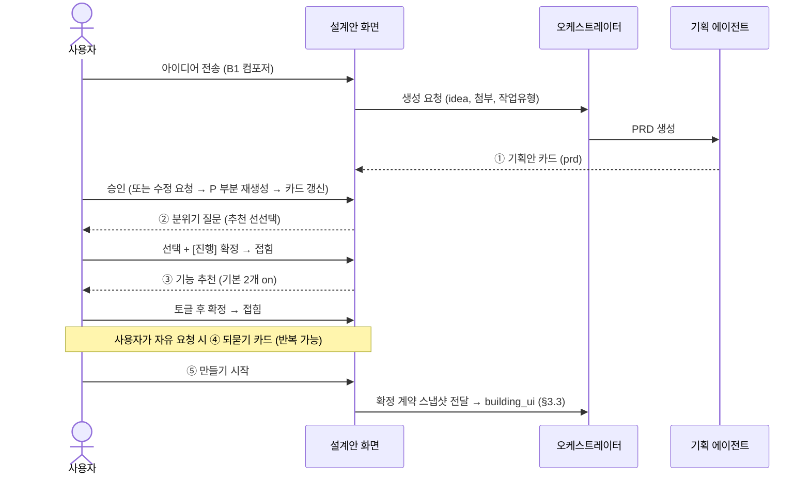

# AiApp 에이전트 기반 자율 생성 — 구현 명세

문서 목적: 개편 제안서(2026.07)에서 정의한 TO-BE 서비스를 개발팀이 구현에 착수할 수 있는 수준으로 설명한다. 본 문서는 상세 기획(PRD)의 초안이며, 확정 표기가 없는 수치·정책은 착수 후 협의로 확정한다.

대상 마일스톤: 모두의 창업 2기 (8월 말). 스코프는 본문 9장의 컷라인을 따른다.

---

## 1. 서비스 개요

사용자가 아이디어를 한 문장으로 입력하면, 에이전트 파이프라인이 기획 → 화면 생성 → DB 스키마 → 기능(API) → 배포·BaaS 프로비저닝을 자율 수행하여 운영 준비가 완료된 서비스를 배포한다. 사용자 접점은 입력 1회와 선택적 확인(확인 모드) 1회로 제한한다. 모든 생성·빌드·실행은 사용자별 micro VM 안에서 이루어진다.

핵심 원칙 세 가지는 다음과 같다. 첫째, 입력은 한 문장이며 제목·도메인·템플릿·레이아웃 등은 에이전트가 아이디어에서 도출한다. 둘째, 에이전트 체인이 기획부터 기능까지 자율 실행하고 개입 지점은 선택적 체크포인트 1곳만 둔다. 셋째, 배포 시점에 BaaS 리소스 프로비저닝이 완료되어 "운영 준비까지 자동"인 상태로 사용자에게 인계한다.

## 2. 사용자 플로우와 화면 명세

### 2.1 화면 B1 — 시작 화면

중앙에 질문형 헤드라인("어떤 서비스를 만들까요?")과 멀티라인 입력창 1개만 배치한다. 입력창 하단에 옵션 3개를 둔다: 첨부파일, 참고 링크(URL), 확인 모드 토글. [생성 시작] 클릭 시 크레딧 견적을 먼저 표시하고(3.4 참조) 사용자가 승인하면 파이프라인을 시작한다.

입력 검증: 최소 길이(예: 10자) 미달 시 구체화를 유도하는 마이크로카피를 노출한다. 첨부는 이미지·문서, 참고 링크는 URL 형식만 허용한다.

### 2.2 화면 B2 — 에이전트 진행 화면

파이프라인의 5단계를 세로 리스트로 표시하고 각 단계의 상태(완료 / 진행 중 / 대기 / 실패)를 실시간 갱신한다. 진행 중 단계는 세부 진척(예: "예약 페이지 작성 중 · 3/6 화면")을 노출한다. 하단 고정 바에 예상 소모 크레딧과 "전용 micro VM에서 실행 중" 표시를 둔다. 실시간 갱신은 SSE(Server-Sent Events)를 기본으로 하고, 연결 유실 시 폴링으로 폴백한다.

확인 모드가 켜진 경우 기획 단계 완료 시 파이프라인을 일시정지하고 기획 요약 카드(서비스명, 핵심 화면 목록, 기능 목록, 디자인 방향)를 표시한다. 사용자는 [이대로 진행] 또는 항목별 수정 후 [수정하고 진행]을 선택한다. 이 지점 외의 개입 UI는 두지 않는다.

**출시 게이트 (2026-07-21 확정)**: 생성 사이클이 끝나도 자동으로 공개하지 않는다. 완료 시 상태는 `ready`(미리보기) — 미리보기 배지는 "미리보기", 주소 표시는 "아직 주소가 없어요 — 출시하면 생겨요". 사용자가 미리보기를 확인하고 [출시하기]를 누르면 **배포 주소 설정이 첫 스텝**이다: 서비스명 기반 서브도메인이 미리 채워진 `____.aiapp.help` 입력 + 실시간 사용 가능 검사 + "내 도메인 연결은 곧 제공"(커스텀 도메인 미지원 — 보류 목록 참조) 안내. [이 주소로 출시하기] → `deployed` 전이, 배지 LIVE·주소 반영·채팅에 출시 보고, 완료 화면에서 주소 복사와 다음 행동(검색 노출·홍보 소재)을 안내한다. 화면 레퍼런스: `design/b2.html` (보고 카드 [출시하기] → 모달).

#### 2.2.1 AI 응답 문법

에이전트의 채팅 출력은 자유 형식이 아니라 **상황별로 형태가 고정**된다 (질문 UI가 §2.4 패턴에 고정되는 것과 같은 원리). 화면 레퍼런스: `design/b2.html` 채팅 피드.

| 상황 | 형태 | 규칙 |
|---|---|---|
| 일반 안내·서술 | 플레인 텍스트 (`log-line`) | 말풍선·아바타 없음(Manus식), 1~2문장, 해요체 |
| 단계 전환 | 구분선 + 단계명 (`log-step`) | 단계명만 — 문장 금지 |
| 작업 완료 사실 | ✓ 체크 줄 (`log-chk`) | 사실 + 사용자 이득 한 줄 |
| 진행 상태 | 다크 콘솔 카드 (`console-card`) | 라이브 위젯 — 행 상태만 갱신, 카드 반복 생성 금지 |
| 차단 질문 | 일시정지 카드 (`pause-card`) | §2.4 — 답 대기, 답변 후 히스토리에 선택 표시로 잔존 |
| 모호한 요청 | 되묻기 카드 (`ask`) | §2.4 — 비차단, 옵션 ≤4 + 기타 |
| 출시 완료 | 보고 카드 (`report`) | 1회 — LIVE·URL·산출 목록·설정 필요 행(§3.2.2) |
| 완료 직후 | 다음 행동 추천 칩 (`next-sugg`) | 클릭 = 입력창 채움 (자동 전송 금지) |
| 단계 실패 | 오류 카드 (`pause-card` 위험 변형) | 자동 재시도(§3.3) 소진 후에만 노출 — 원인 한 줄(쉬운 말) + [다시 시도]/[여기서 멈추기]. 이전 산출물은 보존 안내 |

카피 규칙: 해요체 · 한 메시지 한 사실 · 수치/상태는 카드에 · 개발 용어 번역(테이블→예약/회원, SSE→실시간 연결, VM→전용 공간) · 가능하면 행동 유도로 끝맺기 · 되돌리기는 "이전으로"(버전 금지) · 이모지는 알림성 최소.

#### 2.2.2 응답 동작 상세 — 개발 Q&A (초안)

구현 시 반드시 나올 질문을 개발자 관점에서 선제 정리한 결정 초안. ⚠ 표시는 협의 후 확정 권장.

**Q1. 로그는 스트리밍인가, 한 번에 오나?**
줄 단위 완성형으로 온다 — 타자(typing) 효과 없음. SSE 이벤트 하나 = 채팅 요소 하나이며, 이벤트 `type`이 §2.2.1 문법과 1:1 매핑된다: `log | step | check | console_update | pause | ask | report | suggest | error`. 프런트는 type→컴포넌트 렌더만 하면 되고, 문구 생성 책임은 전부 서버(에이전트) 측이다.

**Q2. 단계가 실패하면 어떻게 말하나?**
단계 내 자동 재시도(§3.3)가 소진된 뒤에만 오류 카드를 낸다(재시도 중엔 진행 상태 카드가 계속 "진행 중"). 오류 카드 = 일시정지 카드의 위험 변형: 원인 한 줄(쉬운 말, 스택트레이스 금지) + [다시 시도]/[여기서 멈추기] + "지금까지 만든 것은 그대로 있어요" 안내. [다시 시도] = resume-from-stage.

**Q3. 운영 중 수정 요청의 처리 표시는?**
짧은 작업(문구·색 등)은 콘솔 카드 없이 로그 2줄로 끝낸다: 접수 즉시 "바꾸고 있어요…" 플레인 로그 → 완료 시 ✓ 체크 줄 + 미리보기 자동 갱신 + '이전으로' 활성화. 화면 추가 같은 큰 작업만 진행 상태 카드를 다시 쓴다. ⚠ 크고 작음의 기준(예상 30초 초과 여부 등)은 구현 협의.

**Q4. 되묻기(ask)는 언제 발동하나?**
두 조건에서만: ① 요청이 복수 해석 가능(결제 방식처럼 실행 결과가 크게 갈림) ② 실행에 필수 값이 빠짐(주소 등). 단순 취향 차이는 묻지 않고 AI 추천으로 진행 후 결과 보고에 명시한다. 되묻기는 요청당 1회 — 꼬리 질문 금지, 그래도 모호하면 기본값으로 진행.

**Q5·Q6. 질문이 떠 있거나 AI가 작업 중일 때 채팅은? (2026-07-21 확정)**
**타이핑은 항상 가능, 전송만 잠근다.** 전송 잠금 사유는 두 가지뿐이다:

- **활성 질의(ask·pause)가 있을 때** — 답을 먼저 받는다. 전송 버튼 비활성 + 빈 입력창 플레이스홀더 "위 질문에 먼저 답해 주세요 ↑". 자유 형식 답변은 질문 카드 안의 '기타' 입력이 담당. 답변(또는 pause 액션) 즉시 해제, 접힌 답을 '변경'으로 다시 열면 재잠금.
- **파이프라인·수정 작업 실행 중** — 전송 버튼 비활성 + "지금 작업 중이에요 — 끝나면 보낼 수 있어요". 사용자가 기다리는 동안 다음 요청을 미리 써둘 수 있고, 작업 완료 시 자동으로 전송이 열리며 써둔 내용은 유지된다. 큐잉은 하지 않는다(전송 자체가 잠기므로 동시 요청 충돌 없음).

**Q7. 다음 행동 추천 칩("이어서 이런 걸 해볼 수 있어요")의 기준 (2026-07-21 정리)**

- **노출 시점**: ① 최초 출시 완료 보고 직후 ② 운영 중 수정 작업 완료 직후 — 이 두 시점에만 1세트. 질의 활성·작업 실행 중엔 노출하지 않고, 매 메시지마다 반복하지 않는다.
- **개수**: 3~4개. 채울 만한 제안이 2개 미만이면 세트 자체를 생략한다(억지로 채우지 않음).
- **슬롯 우선순위**:
  1. **할 일** — 미완 설정(§3.2.2, 결제 연결 등). 단 같은 화면의 보고 카드에 '설정 필요' 행이 이미 보이면 칩으로 중복 노출하지 않는다.
  2. **방금 작업의 자연 후속** — 직전 작업과 같은 맥락의 다음 단계 (홈 문구 수정 → 다른 페이지 문구, 로고 생성 → 홍보 이미지).
  3. **성장 제안** — 브랜드·홍보 소재 등 서비스 카테고리 기반 제안.
  4. (자리가 남으면) **탐색** — 아직 안 써본 기능 소개 (엑셀 내보내기, 도메인 연결 등).
- **문구 형식**: 클릭 시 입력창에 그대로 들어가므로 **사용자 1인칭 요청문**으로 쓴다 ("홈 문구를 더 따뜻하게 바꿔줘" ○ / "문구 수정 기능" ✕). 클릭 즉시 실행 가능한 것만 제안한다 — 외부 절차가 필요한 항목은 요청문 대신 이동 링크형("결제 연결하러 가기 →").
- **중복·소멸**: 이미 실행한 제안, 2세트 연속 노출됐는데 클릭되지 않은 제안은 다음 세트에서 교체한다.
- **클릭 동작**: 입력창 채움까지만 — 자동 전송 금지.

**Q8. 재접속 시 채팅은 어디까지 복원하나?**
프로젝트 채팅 이력 전체를 저장·복원한다. 질문/보고 카드는 최종 상태(답변됨=접힘, 스킵=기본값 표기)로 렌더하고, 미답 차단 카드가 있으면 활성 상태 그대로 + 스크롤을 그 위치로. 그 외에는 맨 아래로 스크롤.

#### 2.2.3 채팅 이벤트 계약 (SSE, 초안 v0.1)

프로젝트당 SSE 스트림 1개. 모든 이벤트는 공통 envelope를 가진다 — `seq`는 단조 증가(순서 보장·중복 제거·재접속 `?after=seq` 커서), 필드명은 API 설계 시 확정하는 **제안**이다.

```json
{ "seq": 214, "type": "check", "ts": "2026-07-21T14:12:03Z", "payload": { } }
```

| type | payload 핵심 필드 | 클라이언트 렌더 (§2.2.1) |
|---|---|---|
| `log` | `text` | 플레인 텍스트 줄 추가 |
| `step` | `name` | 단계 구분선 |
| `check` | `text`, `preview_version?` | ✓ 줄 추가 · preview_version 있으면 미리보기 갱신 |
| `console_update` | `rows[{id,label,state,detail}]`, `footer?` | 기존 진행 카드 patch (최초 1회만 생성) |
| `pause` | `id`, `severity(warn\|danger)`, `text`, `actions[{id,label}]` | 일시정지/오류 카드 — 답 올 때까지 후속 이벤트 없음 |
| `ask` | `id`, `title`(질문), `desc`(설명문 — 왜 묻는지·무엇이 달라지는지), `options[{id,label,desc,recommended}]`, `allow_custom` | 되묻기 카드 (비차단 — 스트림 계속) |
| `report` | `name`, `url`, `items[]`, `todo[{label,section}]` | 완료 보고 카드 + 설정 필요 행 |
| `suggest` | `chips[{label,prompt}]` | 다음 행동 추천 칩 |

사용자 응답은 SSE가 아니라 REST: `POST /projects/{id}/answers { "question_id", "value" }` (자유 채팅은 기존 메시지 API). 카드 접힘은 클라이언트가 낙관적으로 처리하고, POST 실패 시 카드를 복원하고 토스트를 낸다.

클라이언트 필수 동작: ① `seq` 갭 감지 시 커서 재요청 ② 새 요소 도착 시 하단 자동 스크롤 — 단 사용자가 위로 스크롤 중이면 억제하고 "새 메시지 ↓" 배지 ③ 재접속 시 동일 `id`의 pause/ask는 dedupe ④ 전송 잠금 규칙(§2.2.2 Q5·Q6): 질의 활성 또는 작업 실행 중엔 전송 버튼만 비활성 — 타이핑은 항상 가능, 써둔 내용은 해제 시 유지.

### 2.3 화면 B3 — 완료 대시보드

상단에 LIVE 배지와 서비스 URL, 그 아래 BaaS 상태 체크리스트(회원 인증, DB 스키마, 발송 대상 연동, 게시판)를 표시한다. 완료 후 진입점은 두 가지다: 기존 채팅·에디터로 사후 수정, 운영관리(BaaS) 콘솔로 이동. 기존 편집 도구는 TO-BE에서도 그대로 유효하다.

### 2.4 에이전트 질의·선택지 UX 패턴

에이전트가 사용자에게 질문하거나 선택지를 줄 때는 매번 화면을 창작하지 않고 아래 고정 패턴 중 하나를 쓴다(DB 뷰 템플릿과 같은 원리 — 골라서 채우기).

**5원칙**

1. **한 번에 하나** — 질문은 한 화면(카드)에 하나. 여러 답이 필요하면 대화형 스텝으로 쪼갠다(로고 위저드 방식).
2. **기본값 선제 선택** — 모든 선택지는 AI 추천이 선택된 상태로 제시한다. 사용자는 그대로 진행만 해도 되고, 무응답 시 기본값으로 진행한다(스킵 = 실패가 아님).
   **'AI 추천' 배지의 기준** — 추천은 질문당 정확히 1개, 근거 우선순위: ① 프로젝트 맥락 정합(기획서 내용·이미 답한 선택·기존 브랜드와 일관 — 예: 로고 색 추천 = 지금 브랜드색) ② 동종 서비스의 모범 사례(같은 카테고리에서 가장 흔한 선택 — 예: 예약 서비스의 결제 = 예약금만, 노쇼 방지) ③ 동률이면 더 가역적인 쪽(부작용·비용이 적고 되돌리기 쉬운 옵션 — 예: 사진 3장 vs 무제한). 추천 근거는 옵션 설명 한 줄로 반드시 노출한다("노쇼를 줄여줘요"). 세 근거 모두 없으면 배지를 달지 않거나 'AI에게 맡기기'를 추천으로 둔다. 사용자의 과거 선택과 충돌하는 추천은 금지 — 과거 선택이 이긴다.
3. **선택지는 최대 4개 + 직접 입력** — 5개 이상이면 질문을 쪼개거나 "직접 입력"으로 흡수한다. 자유 형식 답은 질문 카드의 '기타' 입력이 담당한다.
4. **질의 활성 중 채팅 잠금** — 질의 카드(ask·pause)가 떠 있는 동안 채팅 입력은 잠긴다(§2.2.2 Q5) — 답을 먼저 받는다. 단 파이프라인 차단 여부는 별개: 취향 질문(ask)은 파이프라인이 계속 돌고, 차단 질문(pause)은 확인 모드 게이트(§2.2)와 실행 중 예외(§3.4) 두 곳으로 한정한다.
5. **답은 로그로 남는다** — 선택 완료 시 선택지 UI는 접히고 요약 한 줄("분위기: 따뜻한 ✓")이 사용자 발화로 채팅에 남는다. 요약을 누르면 재선택할 수 있다. (레퍼런스: blueprint.html `log-answer` — 분위기·기능 카드의 접힘/변경)

**질문 유형 → UI 패턴 매핑**

| 유형 | 예 | 패턴 | 레퍼런스 |
|---|---|---|---|
| 단일 선택 (시각) | 디자인 분위기, 템플릿 | 비주얼 카드 그리드 (썸네일+이름) | blueprint.html `tpick` |
| 단일 선택 (텍스트) | 색상, 스타일 | 단일 선택 칩 | brand.html `cchip[data-single]` |
| 복수 선택 | 추천 기능 켜기 | 토글 칩 (＋↔✓ 스왑) | blueprint.html `fchip` |
| 짧은 자유 입력 | 이름, 주소 | 인라인 한 줄 입력 (비워도 진행) | blueprint.html `card-input` |
| 확인 게이트 | 설계안 승인 | 요약 카드 + [이대로 만들기]/[수정 요청] 버튼 쌍 | blueprint.html `pcard__actions` |
| 경로 분기 | 바로 만들기 vs 더 다듬기 | 경로 카드 2개 (제목+결과 설명) | brand.html `wpath` |
| 구체화 질문 (모호한 요청 되묻기) | "결제도 받고 싶어요" → 어떻게? | **제목(질문) + 설명문(왜 묻는지·무엇이 달라지는지)** + 옵션 카드(AI 추천 표시, 원탭 즉답) + 기타 직접 입력 — 설계 단계와 운영 중 대화 공통 | blueprint.html·b2.html `ask` |
| 실행 중 차단 질문 | 한도 초과, 충돌 | 채팅 인라인 경고 카드 + 버튼, 파이프라인 일시정지 + "답을 기다리고 있어요" 상태 | b2.html `pause-card` (답변된 히스토리 상태) |

**상태 정의**: 질문 카드는 `대기(활성) → 답변됨(요약으로 접힘) / 스킵(기본값 적용 표기)` 세 상태를 가진다. 자율 모드(확인 모드 꺼짐)에서는 비차단 질문을 생략하고 기본값을 쓰되, 완료 보고에 "AI가 대신 고른 것" 목록을 남긴다.

### 2.5 설계안 단계 상세 (B1 → B2 사이) — 개발 참조

동작하는 레퍼런스: `design/blueprint.html` (순차 진행·접힘·되묻기가 실제로 클릭됨). 원칙: **화면에 보이는 모든 정보는 산출물 계약(§3.2)의 필드에서 온다** — 화면 전용 데이터를 만들지 않는다.

#### 흐름



#### 단계별 명세

| # | 단계 | AI가 보여주는 정보 | 데이터 출처 (계약 필드) | 사용자 행동 | 질문 유형 (§2.4) | 무응답·스킵 시 |
|---|---|---|---|---|---|---|
| ① | 기획안 카드 | 서비스명 · 한 줄 소개 · "이런 걸 해결해요" · 핵심 기능(아이콘+설명) · 화면 구성 N개 · 데이터 저장소(테이블+주요 필드) · 타겟 | `prd.service_name` `prd.description` `prd.problem` `prd.features[]` `prd.screens[]` `prd.data_entities[]` `prd.target_user` | [좋아요, 다음으로] 승인 / [수정 요청] → 채팅으로 고쳐 말함 | 확인 게이트 | **차단** — 확인 모드에선 답 대기 (`awaiting_confirm`). 자율 모드는 생략 |
| ② | 분위기 선택 | 스타일 4종 카드(썸네일+이름+한 단어 설명), 추천안 선선택 + 직접 입력 | `design_tokens` 후보 세트 (기획 에이전트가 prd 기반 4종 생성) | 선택 후 [이 분위기로 진행] 확정 → 접힘 (선택만으로 넘어가지 않음) | 단일 선택(시각) | 추천안 적용 |
| ③ | 기능 추천 | 유사 서비스 빈출 기능 칩 (기본 2개 on, 외부 절차 기능엔 '출시 후 연결' 라벨 §3.2.2) + 직접 추가 | `prd.features[]` + 기능 카탈로그(auth·board·recipient·db·custom) | 칩 토글 → [확정] → 접힘 | 복수 선택 | 기본 on 그대로 |
| ④ | 구체화 되묻기 | 모호한 자유 요청을 옵션 2~4개로 좁힘 (AI 추천 표시) + 기타 입력 | 요청 파싱 결과 → 해당 계약 필드에 기록 | 원탭 즉답 / 기타 Enter → 접힘 | 구체화 질문 | AI 추천 적용 |
| ⑤ | 만들기 시작 | 확정 요약("다 정해졌어요") + 시작 버튼 | ①~④ 반영된 계약 스냅샷 | [만들기 시작] → B2 진입 | — | — |

#### 구현 규칙

- **수정 루프**: ①에서 [수정 요청]은 채팅 입력으로 이어지고, 기획 에이전트가 해당 부분만 재생성해 카드를 갱신한다. 이미 답한 ②③은 유지된다.
- **접힘 = 기록**: 모든 답은 "라벨: 값 ✓" 요약으로 채팅에 남고(사용자 발화 취급), 클릭하면 재선택할 수 있다. 재선택해도 이후 단계 답은 보존한다.
- **④는 어디서든**: 되묻기는 설계안 전용이 아니라 채팅 공통 패턴이다(§2.4). 설계안 중이든 운영 중이든 같은 컴포넌트를 쓴다.
- **상태 연결**: ①의 승인이 §3.3의 `awaiting_confirm → building_ui` 전이 트리거다. ②~④는 비차단이므로 자율 모드에선 기본값으로 자동 확정된다.

## 3. 에이전트 파이프라인

### 3.1 구성

오케스트레이터 1개와 실행 에이전트 5개로 구성한다. 오케스트레이터는 단계 순서 제어, 산출물 검증, 상태 전이, 크레딧 계측, 실패 처리를 담당하고 실행 에이전트는 각자의 산출물만 책임진다.

| 순서 | 에이전트 | 입력 | 산출물 |
|---|---|---|---|
| 1 | 기획 | 사용자 문장, 첨부, 참고 링크 | PRD 문서(JSON), 디자인 시스템 토큰, 화면 목록, 기능 요구 목록 |
| — | (체크포인트) | 기획 산출물 요약 | 사용자 승인 또는 수정 반영본 |
| 2 | 화면 생성 | PRD, 디자인 토큰, 화면 목록 | 페이지별 프론트 코드, 라우팅 구성 |
| 3 | DB 설계 | PRD의 데이터 요구 | 테이블 스키마(DDL), 시드 데이터 정의 |
| 4 | 기능(API) | PRD 기능 목록, DB 스키마 | 기능별 API 코드, 프론트 연동 코드 |
| 5 | 배포·BaaS | 전체 산출물 | 배포 완료 URL, BaaS 리소스 프로비저닝 결과 |

### 3.2 산출물 계약(Artifact Contract)

에이전트 간 인터페이스는 자연어가 아니라 스키마가 고정된 JSON 산출물로 한다. 오케스트레이터는 각 단계 완료 시 산출물을 스키마 검증하고, 실패 시 해당 에이전트에 1회 재생성을 지시한 뒤 재실패하면 파이프라인을 실패 상태로 전이한다. 최소 계약 예시:

```json
{
  "prd": {
    "service_name": "string",
    "description": "string  — 한 줄 소개 (설계안 카드·로고 브리프에서 재사용)",
    "problem": "string  — 이런 걸 해결해요 (설계안 카드)",
    "target_user": "string",
    "screens": [{ "id": "string", "name": "string", "purpose": "string" }],
    "features": [{ "id": "string", "type": "auth|board|recipient|db|custom", "description": "string" }],
    "data_entities": [{ "name": "string", "fields": [{ "name": "string", "type": "string" }] }]
  },
  "design_tokens": { "palette": {}, "typography": {}, "layout": {} }
}
```

`features[].type`은 BaaS 프로비저닝 매핑(5장)의 키가 되므로 열거형으로 고정한다. `custom`은 BaaS 표준 기능 밖의 요구를 뜻하며, 기능 에이전트가 개별 API로 생성한다.

#### 3.2.1 DB 뷰 템플릿 계약

데이터베이스 탭 화면은 에이전트가 매번 생성하지 않는다. 플랫폼이 **고정 템플릿 4유형**을 제공하고, 에이전트는 스키마 생성 시 테이블마다 "템플릿 선택 + 슬롯 매핑" 메타데이터만 출력한다(자유 생성 금지 — 골라서 채우기만 허용). 유형과 선택 기준:

| 템플릿 | 용도 | 필수 슬롯 | 선택 기준 |
|---|---|---|---|
| `inbox` 인박스형 | 처리할 일이 쌓이는 데이터 (예약·문의·주문·신청) | who(사람/회사명) · when(일시) · status(enum) | 상태 enum + 일시 + 주체 필드가 모두 있을 때 |
| `feed` 게시글형 | 내용이 주인공인 데이터 (후기·게시글·공지) | author · body(긴 텍스트) · created · 선택: rating(별점) · parent(연결 엔티티 참조) · replied(답변 여부) | 긴 텍스트 본문 필드가 중심일 때 |
| `directory` 명부형 | 엔티티 목록 (회원·제공자·제품·설비) | name · attrs(속성 2~3) | 사람/사물 마스터 데이터일 때 |
| `grid` 표형 | 폴백 — 컬럼을 그대로 그리는 데이터 그리드 | 없음 (스키마 그대로) | **위 매핑이 하나라도 애매하면 무조건** |

요약(대시보드)은 템플릿이 아니라 자동 생성: 테이블별 건수 스탯 + 일시 필드가 있는 테이블의 최근 7일 추이 차트.

**템플릿 공통 UI**: 모든 데이터 뷰는 유형과 무관하게 ① 검색(주요 텍스트 필드 대상), ② 필터 칩(상태 enum 또는 대표 속성 기준, 건수 표기), ③ 엑셀 내보내기, ④ 페이지네이션을 기본 제공한다. 에이전트가 별도로 지정하지 않아도 플랫폼이 슬롯 매핑에서 유도한다(검색 대상 = who/name/body, 필터 축 = status/replied/대표 속성).

`feed` 템플릿은 대량 데이터(쇼핑몰 후기 등 수백~수천 건)를 전제로 다음을 **기본 내장**한다 — 요약 헤더(평균 별점·분포, rating 슬롯이 있을 때), 처리 중심 필터(미답변·저평점, replied/rating 슬롯 기반) + 검색, 본문 2~3줄 클램프 + 더 보기, 페이지네이션. 선택 슬롯 `parent`는 다른 테이블 행 참조(후기→상품/제공자, 댓글→게시글)로, 카드에 소속 칩으로 표시하고 필터 축으로 쓴다. 화면 레퍼런스: `design/db.html` 후기 뷰.

테이블당 계약 예시:

```json
{
  "table": "bookings",
  "label": "예약",
  "template": "inbox",
  "slots": { "who": "customer_name", "contact": "phone", "when": "visit_at" },
  "status": {
    "field": "state",
    "map": { "대기": "warn", "확정": "ok", "취소": "muted" },
    "transitions": [{ "from": "대기", "to": "확정", "label": "확정" }]
  }
}
```

검증 규칙: `slots`가 참조하는 필드는 `data_entities`에 실재해야 하고, `status.map`의 키는 해당 enum 값의 부분집합이어야 한다. 검증 실패 시 재생성 대신 `grid`로 강등한다(폴백이 있으므로 이 계약은 파이프라인을 실패시키지 않는다). 유형별 화면 레퍼런스는 `design/db.html`(사이드바에서 4유형 전환)을 기준으로 한다.

#### 3.2.2 기능 설정의 지연 수집과 폴백 동작

일부 기능은 구현에 추가 정보가 필요하다. 원칙은 **"생성은 멈추지 않고, 연결은 나중에"** — 필요한 정보의 성격에 따라 수집 시점을 다르게 한다. 설계안 단계에서 외부 절차가 필요한 정보를 요구해 흐름을 막는 것을 금지한다.

| 정보 성격 | 예 | 수집 시점 | 파이프라인 동작 |
|---|---|---|---|
| 사용자가 즉시 아는 값 | 지도·위치의 매장/활동 주소 | 설계안 단계 인라인 입력 (선택 — 비워도 진행) | 값이 있으면 반영, 없으면 폴백 |
| 외부 절차 필요 | 결제의 PG 가맹·API 키·사업자 정보 | **출시 후** 관리·설정에서 연결 | 폴백 모드로 스캐폴드 |
| 방문자 권한 | 푸시 알림의 브라우저 권한 | 방문자 런타임 | 소유자 설정 없음 — 그냥 포함 |

기능별 폴백 동작(미설정 시에도 서비스가 동작해야 함):

| 기능 | 폴백 동작 | 연결 후 |
|---|---|---|
| 결제 연동 | 주문 접수만 (무통장/현장결제 안내) | 온라인 결제로 승격 |
| 지도·위치 | 주소 텍스트 표시, 지도는 자리 표시 | 실지도 렌더 |
| 푸시 알림 | 인앱 알림 목록만 | 브라우저 푸시 병행 |
| 알림톡·문자 | 인앱 알림 (발송 API 제공 전 — 5장) | 알림톡 병행 |

요구사항: ① 파이프라인은 설정 미비를 이유로 실패하지 않는다 — 항상 폴백 모드로 생성한다. ② 설정이 필요한 기능은 완료 보고(B2 보고 카드의 "설정이 필요한 기능 N개" 행)와 관리·설정 사이드바 배지("연결 필요")에 노출한다. ③ 연결 완료 시 폴백 → 정식 동작 전환은 재생성 없이 설정 변경만으로 이뤄져야 한다. 화면 레퍼런스: `design/blueprint.html`(기능 칩의 '출시 후 연결' 라벨·주소 인라인 입력), `design/b2.html`(보고 카드), `design/settings.html`(사이드바 배지).

### 3.3 상태 머신

프로젝트 파이프라인 상태는 다음으로 고정한다: `queued → planning → awaiting_confirm(확인 모드 시) → building_ui → building_db → building_api → provisioning → ready(미리보기·미공개) → deployed`, 실패 시 `failed(stage, reason)`, 사용자 취소 시 `cancelled`. `ready → deployed` 전이는 자동이 아니라 **사용자의 [출시하기] + 배포 주소 확정**(§2.2 출시 게이트)으로만 일어난다. 각 전이는 이벤트 로그로 남기고 B2 화면과 SSE로 동기화한다. 부분 실패(예: 화면 6개 중 1개 실패)는 단계 내 재시도로 처리하고, 단계 자체가 실패하면 이전 단계 산출물은 보존한 채 해당 단계부터 재실행할 수 있어야 한다(resume-from-stage).

### 3.4 크레딧 견적과 계측

[생성 시작] 전에 견적 API가 예상 소모 크레딧을 반환하고, 사용자 승인 후 파이프라인 시작 시 견적액을 가예치(hold)한다. 실행 중 실측 사용량을 단계별로 계측하고, 완료 시 실측 기준으로 정산(초과분 추가 차감 또는 잔여분 해제)한다. 실측이 견적의 일정 배율(예: 150%, 협의 확정)을 넘으면 파이프라인을 일시정지하고 사용자에게 계속 여부를 묻는다. 차감 순서는 4버킷 우선순위(7장)를 따른다.

## 4. 실행 환경 — micro VM

사용자(또는 프로젝트) 단위로 격리된 micro VM(Firecracker 계열 검증 후 확정)에서 화면·기능 코드의 빌드와 프리뷰를 실행한다. 원칙은 실행 시 스핀업, 유휴 타임아웃 시 종료이며 상시 점유하지 않는다. VM 이미지에는 표준 빌드 체인(Node 런타임, 프레임워크 템플릿, BaaS SDK 템플릿)을 사전 베이크하여 콜드 스타트를 단축한다.

격리 경계에서 지켜야 할 것: VM 간 네트워크 격리, 프로젝트 파일시스템 분리, 크레딧·인증 토큰 등 플랫폼 시크릿의 VM 내 미노출(오케스트레이터가 프록시). 티어별 VM 스펙·동시 실행 수·타임아웃은 원가 산정 후 요금제와 함께 확정하며, 구현 단계에서는 설정값으로 외부화해 둔다.

## 5. BaaS 프로비저닝 매핑

배포·BaaS 에이전트는 PRD의 `features[].type`을 실제 BaaS 리소스로 매핑한다. 현재 BaaS API(Base URL `https://api.aiapp.link`, 쿠키 기반 JWT, 프로젝트별 `PROJECT_ID`)가 제공하는 기능 기준의 매핑은 다음과 같다.

| features.type | 프로비저닝 작업 | 생성 코드 연동 |
|---|---|---|
| auth | 프로젝트 ID 발급·연결, 회원 인증 활성 | 회원가입(`POST /account/signup-project`), 로그인(`POST /account/login`), 로그아웃, 계정정보 조회 훅을 페이지에 연결 |
| recipient | 발송대상(연락처) 저장소 활성 | 예약·문의·구독 폼 제출 시 `POST /recipient/{project_id}` 호출 코드 생성 (전화번호 `010-XXXX-XXXX` 검증 포함) |
| board | 공지사항·FAQ 보드 생성 | 목록·상세 조회(공개 API, 인증 불필요) 페이지 생성 |
| db | 테이블 스키마 적용 | DB 에이전트 산출 DDL 적용 및 CRUD API 연동 |

주의사항 두 가지. 첫째, 프론트 연동 코드는 BaaS 통합 스킬의 표준 템플릿(훅: useLogin, useSignup, useRecipient, useNotice, useFaq 등)을 코드 생성의 기준 템플릿으로 사용해 품질 편차를 줄인다. 환경변수는 프레임워크별 규약(`NEXT_PUBLIC_BAAS_PROJECT_ID` 등)을 따른다. 둘째, 메시지 자동 발송 트리거(예: "예약 완료 시 알림톡 발송")는 현재 BaaS 공개 API에 발송 엔드포인트가 포함되어 있지 않으므로, 발송대상 등록까지를 필수 범위로 하고 발송 트리거 자동 연결은 에어미디어 연동 확정 후 후속 범위로 구현한다. 발송이 열리는 시점에는 발송 크레딧 차감(알림톡 20 / SMS 25 / LMS 75 / MMS 150)과 무료 재원 차단 규칙(7장)을 반드시 함께 적용한다.

## 6. API 초안 (플랫폼 측)

| 메서드·경로 | 설명 |
|---|---|
| `POST /v2/projects/estimate` | 입력 문장·첨부 기반 크레딧 견적 반환 |
| `POST /v2/projects/generate` | 파이프라인 시작. body: 입력 문장, 첨부 ID, 옵션(confirm_mode: bool). 견적 승인 토큰 필수 |
| `GET /v2/projects/{id}/pipeline` | 파이프라인 상태·단계별 진척 조회 |
| `GET /v2/projects/{id}/pipeline/stream` | SSE 진행 스트림 (상태 전이·세부 진척 이벤트) |
| `POST /v2/projects/{id}/confirm` | 확인 모드 체크포인트 응답 (승인 또는 수정 사항 포함) |
| `POST /v2/projects/{id}/cancel` | 파이프라인 취소 (진행 단계까지의 실측 크레딧만 정산) |
| `POST /v2/projects/{id}/resume` | 실패 단계부터 재실행 |

기존 위저드 API는 유지한 채 v2 네임스페이스로 병행 배치한다(전환 리스크 대응).

## 7. 크레딧 처리 규칙

버킷은 4종이며 차감 우선순위는 고정 순서로 한다: 일일 무료 → 이벤트·쿠폰 → 플랜 번들 → 충전. 원칙은 소멸이 빠른 재원부터 소모하는 것이다.

| 버킷 | 지급 | 소멸 | 이월 | 발송 사용 |
|---|---|---|---|---|
| 일일 무료 | 활성(접속) 사용자에 매일 리셋 | 당일 | 불가 | 불가 (AI 생성·수정 전용) |
| 이벤트·쿠폰 | 캠페인·추천인·CS 보상 | 유효기간 (기본 30일 권장) | 불가 | 쿠폰별 플래그, 기본 불가 |
| 플랜 번들 | 구독 시 월 지급 | 월말 | 불가 | 가능 |
| 충전 | 유료 구매 | 없음 또는 장기 | 유지 | 가능 |

구현 요건: 쿠폰은 금액이 아닌 정책 객체(금액, 유효기간, 사용 범위 플래그, 지급 트리거, 중복 보유 규칙)로 모델링한다. 일일 무료 크레딧은 미접속일 미지급(적립 아님)으로 하고, 신규 가입 계정은 인증(휴대폰 등) 완료 후 지급을 시작한다. 지급량 수치는 시뮬레이션 후 확정하되 설정값으로 외부화한다. 모든 차감은 버킷별 원장(ledger)에 기록해 회계 성격(판촉비 / 구독 매출 / 선수금)별 집계가 가능해야 한다.

## 8. 비기능 요구

진행 화면의 상태 반영 지연은 수 초 이내를 목표로 한다(SSE 기준). 파이프라인 전체 소요 시간 목표, 동시 파이프라인 처리량, VM 콜드 스타트 목표치는 PoC 측정 후 확정한다. 모든 에이전트 호출은 프로젝트 ID·단계·토큰 사용량·소요 시간을 구조화 로그로 남겨 크레딧 정산과 품질 분석에 공용한다. 개인정보(사용자 입력 문장, 첨부)는 조직 보안 정책에 따라 취급하고 VM 폐기 시 프로젝트 산출물 외 임시 데이터는 함께 파기한다.

## 9. 스코프 컷라인 (모두의 창업 2기 기준)

필수 범위(8월 말): 화면 B1·B2·B3, 파이프라인 5단계 자율 실행, 확인 모드 체크포인트, 산출물 계약과 상태 머신, micro VM 격리 실행, BaaS 프로비저닝(auth·recipient·board·db), 크레딧 견적·가예치·실측 정산, 기존 위저드 병행 유지.

후속 범위(2기 이후): 일일 리셋·4버킷 전면 적용(2기 시점에는 기존 차감 체계 유지 가능), 알림톡 발송 트리거 자동 연결, 확인 모드 고도화(항목별 인라인 수정), resume-from-stage의 세분화, 티어별 VM 정책 차등, 태스크 단위 정액제.

지연 발생 시 일정이 아니라 범위를 줄이는 것을 원칙으로 하며, 컷라인 이동은 주간 마일스톤 점검에서 결정한다.

## 10. 미결 사항 (착수 후 확정)

일일 크레딧 지급량과 티어별 차등, 견적 초과 배율 임계값, micro VM 기술 스택 최종 선정(Firecracker 계열 검증), 티어별 VM 스펙·동시 실행 수·유휴 타임아웃, 발송 트리거의 에어미디어 연동 방식, 버킷별 회계 처리 기준. 이 항목들은 제안서의 의사결정 요청(원가 산정 착수)과 연동된다.

---

*(주)엠바스 · AiApp — 내부 문서 · 2026.07*
